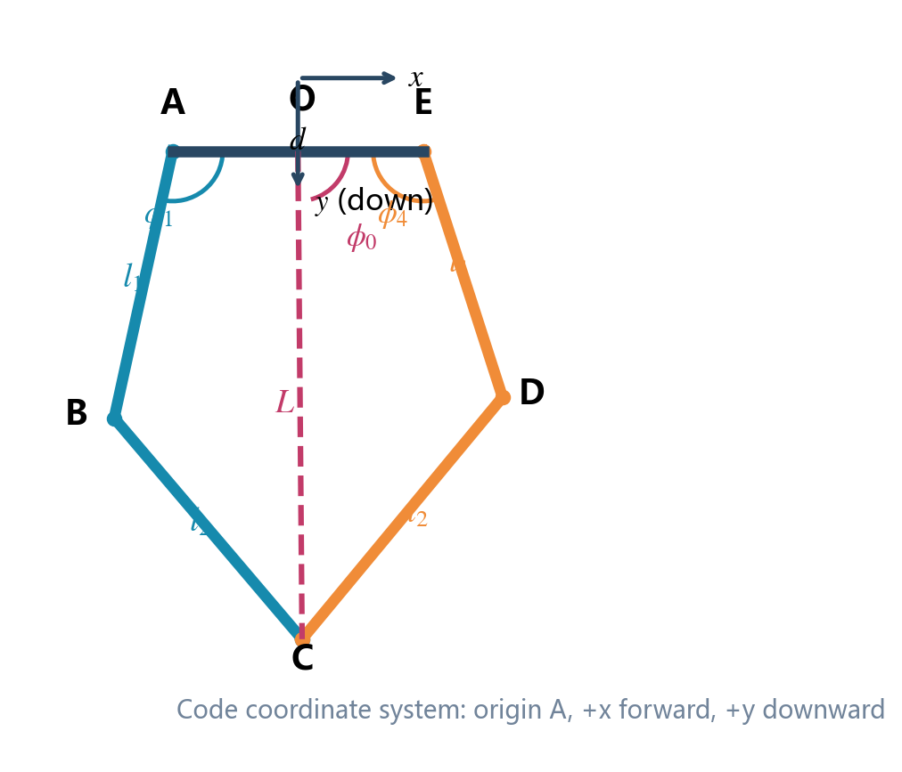
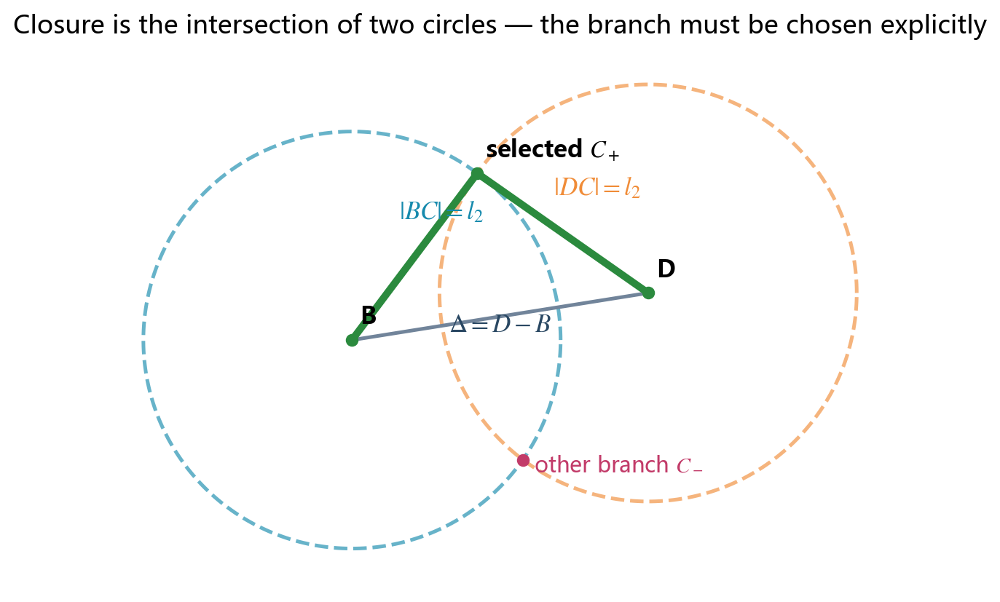
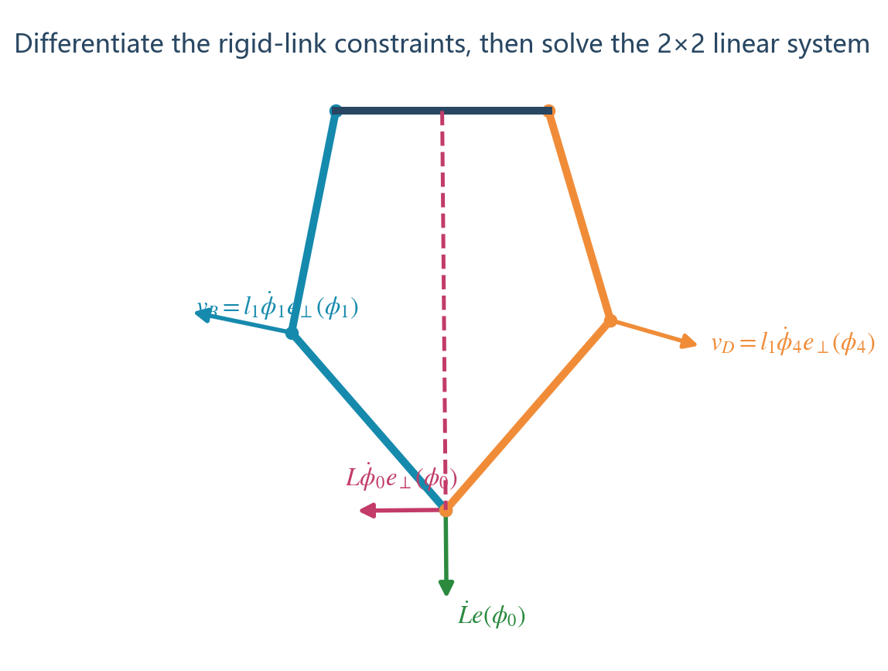
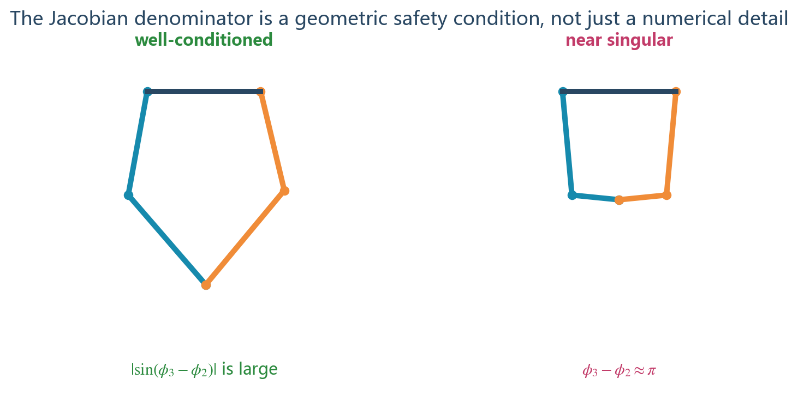
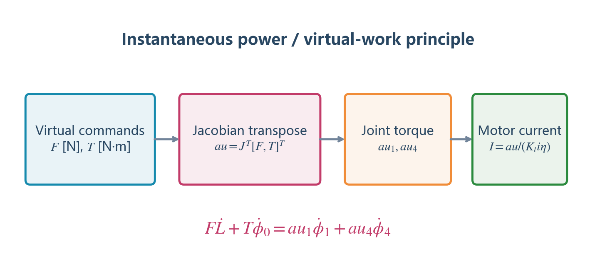

# 并联五连杆公式完整推导

本文只接受一条推导路线：先定义量，再写依据，再代入，再整理，最后给出可检查的结果。这样可以避免角度方向、坐标正负和雅可比转置在不同文章之间互相冲突。

## 1. 机构、坐标与符号

单腿由闭环 `A–B–C–D–E–A` 组成：

- A：后髋主动关节；
- E：前髋主动关节；
- B、D：被动膝关节；
- C：轮轴中心，同时是虚拟腿末端；
- O：A、E 中点，用来定义虚拟腿；
- AB、ED：主动杆，长度均为 `l1`；
- BC、DC：从动杆，长度均为 `l2`；
- AE：两髋间距 `d`。

采用与当前 C 实现一致的单腿局部坐标：A 为原点，`+x` 向前，`+y` 向下。所有杆角都从 `+x` 出发、按同一正方向测量。

### 1.1 符号表

| 符号 | 单位 | 定义 | 是否测量 |
|---|---:|---|---|
| `l1` | m | 主动杆 AB、ED 长度 | 参数 |
| `l2` | m | 从动杆 BC、DC 长度 | 参数 |
| `d` | m | 髋关节距离 AE | 参数 |
| `phi1` | rad | AB 的绝对角 | 编码器输入 |
| `phi4` | rad | ED 的绝对角 | 编码器输入 |
| `phi2` | rad | BC 的绝对角 | 闭链计算 |
| `phi3` | rad | DC 的绝对角 | 闭链计算 |
| `(xB,yB)` 等 | m | 各点局部坐标 | 计算量 |
| `O=(d/2,0)` | m | 两髋中点 | 固定点 |
| `L` | m | 虚拟腿 OC 长度 | 计算量 |
| `phi0` | rad | OC 相对 `+x` 的角 | 计算量 |
| `pitch` | rad | 机身俯仰角 | IMU 输入 |
| `theta` | rad | 虚拟腿相对世界竖直的倾角 | 控制状态 |
| `F` | N | 沿虚拟腿长度方向的广义力 | 控制输出 |
| `T` | N·m | 绕 O 改变 `phi0` 的广义力矩 | 控制输出 |
| `tau1,tau4` | N·m | A、E 两个电机力矩 | 执行器输出 |

为缩短后续公式，定义二维单位向量：

$$
\mathbf e(\alpha)=
\begin{bmatrix}\cos\alpha\\\sin\alpha\end{bmatrix},\qquad
\mathbf e_\perp(\alpha)=
\begin{bmatrix}-\sin\alpha\\\cos\alpha\end{bmatrix}.
$$

`e_perp` 是 `e` 逆时针旋转 90° 后的方向。杆以角速度 `alpha_dot` 转动时，长度为 `l` 的端点速度为 `l*alpha_dot*e_perp(alpha)`。

## 2. 主动杆端点 B、D

**依据：[解析几何] 极坐标到直角坐标。**

A 为原点，因此：

$$
\mathbf r_B=\mathbf r_A+l_1\mathbf e(\phi_1)
=\begin{bmatrix}l_1\cos\phi_1\\l_1\sin\phi_1\end{bmatrix}.
$$

E 的坐标为 `(d,0)`，因此：

$$
\mathbf r_D=\mathbf r_E+l_1\mathbf e(\phi_4)
=\begin{bmatrix}d+l_1\cos\phi_4\\l_1\sin\phi_4\end{bmatrix}.
$$

写成标量：

$$
\begin{aligned}
x_B&=l_1\cos\phi_1,& y_B&=l_1\sin\phi_1,\\
x_D&=d+l_1\cos\phi_4,& y_D&=l_1\sin\phi_4.
\end{aligned}
$$

这一步只计算两个主动杆末端，还没有使用闭链条件。

## 3. 闭链位置解：从 B、D 求 C

### 3.1 两个长度约束

**依据：[闭链约束] 刚性从动杆长度保持 `l2`。**

点 C 同时位于“以 B 为圆心、半径 `l2`”和“以 D 为圆心、半径 `l2`”的圆上：

$$
\|\mathbf r_C-\mathbf r_B\|^2=l_2^2,
\qquad
\|\mathbf r_C-\mathbf r_D\|^2=l_2^2.
$$

两个圆通常有两个交点，对应五连杆的两种装配分支。轮腿控制必须固定使用膝盖朝外且轮轴位于髋部下方的分支，不能每一帧只按“哪个解更近”随意切换。

### 3.2 用从动杆角 `phi2` 表示 C

从 B 沿 BC 走 `l2`：

$$
\mathbf r_C=\mathbf r_B+l_2\mathbf e(\phi_2).
$$

定义 B 指向 D 的向量与平方距离：

$$
\Delta=\mathbf r_D-\mathbf r_B=
\begin{bmatrix}\Delta x\\\Delta y\end{bmatrix},
\qquad
S=\|\Delta\|^2=(\Delta x)^2+(\Delta y)^2.
$$

将 `rC=rB+l2 e(phi2)` 代入第二根从动杆约束：

$$
\|\mathbf r_B+l_2\mathbf e(\phi_2)-\mathbf r_D\|^2=l_2^2.
$$

因为 `rB-rD=-Delta`，展开平方：

$$
\|-\Delta+l_2\mathbf e(\phi_2)\|^2
=\|\Delta\|^2-2l_2\Delta^T\mathbf e(\phi_2)+l_2^2=l_2^2.
$$

两侧消去 `l2^2`：

$$
2l_2\Delta^T\mathbf e(\phi_2)=S.
$$

展开点积：

$$
2l_2\Delta x\cos\phi_2+2l_2\Delta y\sin\phi_2=S.
$$

定义：

$$
A_0=2l_2\Delta x,\qquad B_0=2l_2\Delta y,
$$

闭链方程缩写为：

$$
A_0\cos\phi_2+B_0\sin\phi_2=S. \tag{1}
$$

### 3.3 半角代换求 `phi2`

**依据：[解析几何] 正切半角公式。**

令 `t=tan(phi2/2)`，则：

$$
\cos\phi_2=\frac{1-t^2}{1+t^2},\qquad
\sin\phi_2=\frac{2t}{1+t^2}.
$$

代入式 (1)，并乘以 `1+t^2`：

$$
A_0(1-t^2)+2B_0t=S(1+t^2).
$$

把所有项移到一边并按 `t` 的次数排列：

$$
(A_0+S)t^2-2B_0t+(S-A_0)=0.
$$

使用一元二次方程求根公式：

$$
t=\frac{B_0\pm\sqrt{A_0^2+B_0^2-S^2}}{A_0+S}.
$$

由于 `phi2=2 atan(t)`，为了保留象限并处理分母接近零的情况，程序使用双参数反正切：

$$
\boxed{
\phi_2=2\operatorname{atan2}
\left(B_0\pm\sqrt{A_0^2+B_0^2-S^2},\ A_0+S\right)
}. \tag{2}
$$

根号内部：

$$
R_c=A_0^2+B_0^2-S^2
$$

必须满足 `Rc>0`。`Rc<0` 表示两圆不相交，即当前编码器角与杆长参数不能组成闭链；`Rc≈0` 表示两圆相切，机构接近边界奇异点。

式 (2) 中的正负号决定装配分支。当前工程固定采用与实物膝盖方向一致的一支，并在启动前验证。

### 3.4 求 C 和 `phi3`

选定 `phi2` 后：

$$
\boxed{
x_C=x_B+l_2\cos\phi_2,qquad
y_C=y_B+l_2\sin\phi_2
}. \tag{3}
$$

DC 的方向向量是 `C-D`，所以：

$$
\boxed{
\phi_3=\operatorname{atan2}(y_C-y_D,\ x_C-x_D)
}. \tag{4}
$$

至此，从两个主动角 `(phi1,phi4)` 得到了完整闭链姿态 `(phi2,phi3,C)`。

## 4. 五连杆等效为一根虚拟腿

五连杆控制不直接把四根杆都放进上层控制器，而是把 O 到 C 视为一根可伸缩、可摆动的虚拟腿。

O 的坐标为：

$$
\mathbf r_O=\begin{bmatrix}d/2\\0\end{bmatrix}.
$$

C 相对 O 的坐标：

$$
x=x_C-d/2,\qquad y=y_C.
$$

**依据：[解析几何] 向量长度与方向角。**

$$
\boxed{L=\sqrt{x^2+y^2}}, \tag{5}
$$

$$
\boxed{\phi_0=\operatorname{atan2}(y,x)}. \tag{6}
$$

在本坐标中竖直向下对应 `phi0=pi/2`。如果机体 pitch 为零且腿竖直向下，希望控制状态 `theta=0`，因此定义：

$$
\boxed{\theta=\phi_0-\frac{\pi}{2}-pitch}. \tag{7}
$$

式 (7) 是坐标变换，不是动力学定律。若 IMU 的 pitch 正方向与这里相反，入口处必须先统一符号，不能在后面的 PID 或 LQR 中临时改正负号。

## 5. 从位置约束推导速度雅可比

目标是建立：

$$
\begin{bmatrix}\dot L\\\dot\phi_0\end{bmatrix}
=J
\begin{bmatrix}\dot\phi_1\\\dot\phi_4\end{bmatrix}. \tag{8}
$$

### 5.1 主动杆末端速度

**依据：[刚体速度] 平面定长杆端点速度。**

$$
\mathbf v_B=l_1\dot\phi_1\mathbf e_\perp(\phi_1),
\qquad
\mathbf v_D=l_1\dot\phi_4\mathbf e_\perp(\phi_4). \tag{9}
$$

### 5.2 刚性从动杆的速度约束

BC 长度不变：

$$
(\mathbf r_C-\mathbf r_B)^T(\mathbf r_C-\mathbf r_B)=l_2^2.
$$

**依据：[链式法则] 对时间求导。**

$$
2(\mathbf r_C-\mathbf r_B)^T(\mathbf v_C-\mathbf v_B)=0.
$$

除以 `2l2`，并用 `(rC-rB)/l2=e(phi2)`：

$$
\mathbf e(\phi_2)^T\mathbf v_C
=\mathbf e(\phi_2)^T\mathbf v_B. \tag{10}
$$

同理，对 DC：

$$
\mathbf e(\phi_3)^T\mathbf v_C
=\mathbf e(\phi_3)^T\mathbf v_D. \tag{11}
$$

式 (10)、(11) 的物理含义是：刚性杆两端沿杆轴方向的速度分量相同，否则杆长会改变。

### 5.3 把 C 的速度写成虚拟腿分量

由 `rC-rO=L e(phi0)`，对时间求导：

$$
\boxed{
\mathbf v_C=\dot L\mathbf e(\phi_0)
+L\dot\phi_0\mathbf e_\perp(\phi_0)
}. \tag{12}
$$

式 (12) 第一项沿腿方向伸缩，第二项沿切向摆动。

### 5.4 代入两个轴向约束

使用恒等式：

$$
\mathbf e(\alpha)^T\mathbf e(\beta)=\cos(\alpha-\beta),
$$

$$
\mathbf e(\alpha)^T\mathbf e_\perp(\beta)=\sin(\alpha-\beta).
$$

将式 (9)、(12) 代入式 (10)：

$$
\cos(\phi_0-\phi_2)\dot L
-L\sin(\phi_0-\phi_2)\dot\phi_0
=-l_1\sin(\phi_1-\phi_2)\dot\phi_1. \tag{13}
$$

将式 (9)、(12) 代入式 (11)：

$$
\cos(\phi_0-\phi_3)\dot L
-L\sin(\phi_0-\phi_3)\dot\phi_0
=l_1\sin(\phi_3-\phi_4)\dot\phi_4. \tag{14}
$$

式 (13)、(14) 是关于 `Ldot` 和 `phi0dot` 的二元一次方程：

$$
\begin{bmatrix}
c_{02}&-Ls_{02}\\
c_{03}&-Ls_{03}
\end{bmatrix}
\begin{bmatrix}\dot L\\\dot\phi_0\end{bmatrix}
=
\begin{bmatrix}
-l_1s_{12}\dot\phi_1\\
l_1s_{34}\dot\phi_4
\end{bmatrix}, \tag{15}
$$

其中：

$$
s_{ij}=\sin(\phi_i-\phi_j),\qquad
c_{ij}=\cos(\phi_i-\phi_j).
$$

系数矩阵的行列式为：

$$
\det=L\sin(\phi_3-\phi_2)=Ls_{32}. \tag{16}
$$

使用二阶线性方程的克拉默法则整理，得到：

$$
\boxed{
J=\begin{bmatrix}
\dfrac{l_1s_{03}s_{12}}{s_{32}} &
\dfrac{l_1s_{02}s_{34}}{s_{32}}\\[10pt]
\dfrac{l_1c_{03}s_{12}}{Ls_{32}} &
\dfrac{l_1c_{02}s_{34}}{Ls_{32}}
\end{bmatrix}
}. \tag{17}
$$

因此：

$$
\dot L=J_{11}\dot\phi_1+J_{12}\dot\phi_4, \tag{18}
$$

$$
\dot\phi_0=J_{21}\dot\phi_1+J_{22}\dot\phi_4. \tag{19}
$$

由式 (7)：

$$
\boxed{\dot\theta=\dot\phi_0-\dot{pitch}}. \tag{20}
$$

### 5.5 奇异性为什么必须检查

式 (17) 的分母含 `s32=sin(phi3-phi2)`。当两根从动杆接近平行或共线时，`|s32|` 接近零，雅可比元素会迅速增大：很小的编码器噪声会被放大成很大的虚拟速度或电机力矩。

工程判据：

$$
|\sin(\phi_3-\phi_2)|>\varepsilon_s,
\qquad L>\varepsilon_L. \tag{21}
$$

`epsilon_s` 不是越小越好。应结合编码器噪声、浮点精度、最大允许力矩和 CAD 工作区，通过扫描得到安全阈值。当前便携代码至少用 `1e-6` 防止除零，实车还应设置更保守的软限位。

## 6. VMC：从虚拟力到两个电机力矩

上层控制器输出虚拟广义力：

$$
\mathbf Q_v=
\begin{bmatrix}F\\T\end{bmatrix}.
$$

其中 `F` 与广义坐标 `L` 配对，`T` 与 `phi0` 配对。

### 6.1 虚功/瞬时功率等价

**依据：[虚功原理] 理想无质量约束杆和理想关节不消耗功率。**

虚拟端的瞬时功率：

$$
P_v=F\dot L+T\dot\phi_0
=\mathbf Q_v^T
\begin{bmatrix}\dot L\\\dot\phi_0\end{bmatrix}. \tag{22}
$$

电机端的瞬时功率：

$$
P_m=\tau_1\dot\phi_1+\tau_4\dot\phi_4
=\boldsymbol\tau^T\dot{\mathbf q}, \tag{23}
$$

其中：

$$
\boldsymbol\tau=\begin{bmatrix}\tau_1\\\tau_4\end{bmatrix},
\qquad
\dot{\mathbf q}=\begin{bmatrix}\dot\phi_1\\\dot\phi_4\end{bmatrix}.
$$

由式 (8)：

$$
P_v=\mathbf Q_v^TJ\dot{\mathbf q}
=(J^T\mathbf Q_v)^T\dot{\mathbf q}. \tag{24}
$$

要求任意允许的 `qdot` 下 `Pv=Pm`，所以：

$$
\boxed{\boldsymbol\tau=J^T\mathbf Q_v}. \tag{25}
$$

展开：

$$
\boxed{
\tau_1=J_{11}F+J_{21}T
}, \tag{26}
$$

$$
\boxed{
\tau_4=J_{12}F+J_{22}T
}. \tag{27}
$$

这解释了代码为什么是 `J` 的转置映射。速度方向是 `虚拟速度=J×关节速度`；力方向必须转置，才能保持功率相等。

### 6.2 符号检查方法

不要只看站立是否稳定来猜正负号。选取一组非奇异姿态和任意关节速度，计算两边功率：

$$
P_m=\tau_1\dot\phi_1+\tau_4\dot\phi_4,
$$

$$
P_v=F\dot L+T\dot\phi_0.
$$

若坐标、雅可比和力矩方向一致，两者应在浮点误差范围内相等。这个测试可以在不接电机的 PC 单元测试中完成。

## 7. 支撑力为什么要加重力前馈

VMC 只负责映射，不负责决定 `F` 和 `T` 的数值。腿长控制常使用外环位置、内环速度：

$$
\dot L_{ref}=K_{p,L}(L_{ref}-L)+K_{i,L}\int(L_{ref}-L)dt-K_{d,L}\dot L, \tag{28}
$$

$$
F_{fb}=K_{p,v}(\dot L_{ref}-\dot L)
+K_{i,v}\int(\dot L_{ref}-\dot L)dt. \tag{29}
$$

仅使用反馈时，机器人必须产生一个持续误差才能抵消重力。加入重力前馈：

**依据：[牛顿第二定律] 竖直静止时 `sum Fy=0`。**

若单条虚拟腿承担等效质量 `m_leg`，竖直附近：

$$
F_{ff}\cos\theta\approx m_{leg}g. \tag{30}
$$

小角度且控制频率高时可用：

$$
F_{ff}\approx m_{leg}g. \tag{31}
$$

最终：

$$
\boxed{F=F_{fb}+F_{ff}+F_{roll}+F_{dynamic}}. \tag{32}
$$

当前便携实现使用 `body_mass_kg*9.81` 作为每侧基础前馈。这个参数按代码定义是“每侧等效承载质量”，若传入整车总质量，会把前馈加倍。移植时应明确质量定义并通过称重或静态电流校准。

## 8. 整车平衡模型使用了哪些力学定律

五连杆先被等效为长度 `L0` 的虚拟腿，再建立轮、腿和机身的平面模型。状态选为：

$$
\mathbf x=
\begin{bmatrix}
\theta&\dot\theta&x_b&\dot x_b&\varphi&\dot\varphi
\end{bmatrix}^T, \tag{33}
$$

控制输入：

$$
\mathbf u=\begin{bmatrix}T_w&T_p\end{bmatrix}^T, \tag{34}
$$

`Tw` 为轮电机力矩，`Tp` 为虚拟髋力矩。

### 8.1 参数

| 符号 | 定义 |
|---|---|
| `mw,Iw,R` | 单轮质量、转动惯量、半径 |
| `mp,Ip` | 等效腿质量、绕参考点惯量 |
| `M,IM` | 机身质量、俯仰惯量 |
| `L`、`LM` | 虚拟腿分成的两段长度，代码取 `L=LM=L0/2` |
| `l` | 机身质心相对转轴的偏置 |
| `N,P` | 腿系统的水平、竖直内力 |
| `NM,PM` | 机身受到的水平、竖直内力 |
| `g` | 重力加速度 |

### 8.2 平动方程

**依据：[牛顿第二定律] `sum F=ma`。**

原模型先写几何加速度关系：

$$
\ddot x=\ddot x_b-(L+L_M)\ddot\theta\cos\theta
+(L+L_M)\dot\theta^2\sin\theta. \tag{35}
$$

机身质心的水平、竖直惯性力分量写为：

$$
N_M=M[\ddot x+(L+L_M)\ddot\theta\cos\theta
-(L+L_M)\dot\theta^2\sin\theta
-l\ddot\varphi\cos\varphi+l\dot\varphi^2\sin\varphi], \tag{36}
$$

$$
P_M=M[g-(L+L_M)\ddot\theta\sin\theta
-(L+L_M)\dot\theta^2\cos\theta
-l\ddot\varphi\sin\varphi-l\dot\varphi^2\cos\varphi]. \tag{37}
$$

等效腿的合力：

$$
N=m_p[\ddot x+L\ddot\theta\cos\theta-L\dot\theta^2\sin\theta]+N_M, \tag{38}
$$

$$
P=m_p[g-L\dot\theta^2\cos\theta-L\ddot\theta\sin\theta]+P_M. \tag{39}
$$

轮子的平动/转动合并方程：

$$
\boxed{
\ddot x=\frac{T_w-NR}{I_w/R+m_wR}
}. \tag{40}
$$

### 8.3 转动方程

**依据：[欧拉转动定律] `sum tau=I alpha`。**

绕虚拟腿参考点：

$$
I_p\ddot\theta=(PL+P_ML_M)\sin\theta
-(NL+N_ML_M)\cos\theta-T_w+T_p. \tag{41}
$$

机身俯仰：

$$
I_M\ddot\varphi=T_p+N_Ml\cos\varphi+P_Ml\sin\varphi. \tag{42}
$$

式 (35)～(42) 是当前增益生成器的连续非线性模型来源。它们依赖集中质量和刚体平面运动假设，不等同于 MuJoCo 的完整三维接触模型。

## 9. 从非线性方程到 LQR

### 9.1 平衡点线性化

选直立、静止平衡点：

$$
\mathbf x_0=\mathbf 0,\qquad \mathbf u_0=\mathbf 0.
$$

**依据：[线性化] 一阶泰勒展开。**

对非线性状态方程 `xdot=f(x,u)`：

$$
\dot{\delta\mathbf x}=A\delta\mathbf x+B\delta\mathbf u, \tag{43}
$$

$$
A=\left.\frac{\partial f}{\partial x}\right|_{x_0,u_0},
\qquad
B=\left.\frac{\partial f}{\partial u}\right|_{x_0,u_0}. \tag{44}
$$

这里不是把 `sin` 和 `cos` 随意删除，而是在零点使用：

$$
\sin\alpha\approx\alpha,\qquad
\cos\alpha\approx1,
$$

并舍弃 `alpha^2`、`alpha*alpha_dot` 等二阶小量。

### 9.2 LQR 性能指标

**依据：[最优控制] 连续时间二次型调节器。**

$$
\mathcal J=\int_0^\infty
(\mathbf x^TQ\mathbf x+\mathbf u^TR\mathbf u)dt. \tag{45}
$$

`Q>=0` 惩罚状态误差，`R>0` 惩罚控制量。求解代数 Riccati 方程得到：

$$
A^TP+PA-PBR^{-1}B^TP+Q=0, \tag{46}
$$

$$
\boxed{K=R^{-1}B^TP},\qquad
\boxed{\mathbf u=-K\mathbf x}. \tag{47}
$$

嵌入式实际使用离散模型：

$$
\mathbf x_{k+1}=A_d\mathbf x_k+B_d\mathbf u_k, \tag{48}
$$

并解离散 Riccati 方程。工程按腿长生成多个 `K(L)`，再用三次多项式拟合每个增益元素：

$$
\boxed{k_i(L)=a_iL^3+b_iL^2+c_iL+d_i}. \tag{49}
$$

在线使用 Horner 形式减少乘法和中间误差：

$$
k_i(L)=((a_iL+b_i)L+c_i)L+d_i. \tag{50}
$$

## 10. 一次完整控制周期的数学顺序

1. 读取 `phi1,phi4`、关节速度、IMU、轮速和接触力；
2. 用式 (2)～(7) 解闭链和虚拟腿；
3. 用式 (17)～(20) 求虚拟腿速度；
4. 以当前 `L` 代入式 (50) 得到在线增益；
5. 用式 (47) 求轮力矩和虚拟髋力矩；
6. 用式 (28)～(32) 求支撑力；
7. 用式 (26)、(27) 映射为两个髋电机力矩；
8. 做奇异性、有限数、机械范围和力矩限幅检查；
9. 输出到电机驱动，并保存诊断量供下一周期使用。

第二篇文档将逐项把这个顺序写成 C，并解释每个临时变量对应哪条公式。

## 11. 推导自检清单

- 把 `phi1,phi4` 代回后，AB、ED 长度是否恒为 `l1`？
- 求得 C 后，BC、DC 长度是否同时等于 `l2`？
- 装配分支是否与实物一致，连续运动中是否会跳支？
- 数值差分 `d(L,phi0)/d(phi1,phi4)` 是否与式 (17) 一致？
- 任意测试速度下，`F*Ldot+T*phi0dot` 是否等于 `tau1*phi1dot+tau4*phi4dot`？
- 静止时重力前馈是否与每侧实际承载质量匹配？
- `|sin(phi3-phi2)|` 接近阈值时是否停止输出，而不是继续放大力矩？
- 修改质量、惯量、轮半径后是否重新生成并验证 `A/B/K`？

## 12. 参考依据

本文的坐标和最终变量名以本工程代码为准；通用原理可对照以下资料：

1. Kevin M. Lynch, Frank C. Park, *Modern Robotics: Mechanics, Planning, and Control*, Cambridge University Press, 2017：速度雅可比、静力/力矩的雅可比转置关系。
2. John J. Craig, *Introduction to Robotics: Mechanics and Control*, 3rd ed., Pearson, 2005：平面连杆运动学、速度传播和雅可比。
3. Katsuhiko Ogata, *Modern Control Engineering*, 5th ed., Prentice Hall, 2010：状态空间、平衡点线性化与反馈控制。
4. Frank L. Lewis, Draguna Vrabie, Vassilis L. Syrmos, *Optimal Control*, 3rd ed., Wiley, 2012：二次型性能指标与 Riccati 方程。
5. 本工程 `balance_chassis-main/matlab.zip/GenerateGains.m`：式 (35)～(42) 对应的轮腿集中参数模型。
6. 本工程 `balance_chassis-main/application/chassis/linkNleg.h`：闭链、虚拟腿、雅可比与 VMC 的参考实现。

引用通用机器人教材并不表示本文照搬其中某个五连杆公式；式 (1)～(27) 按本文坐标定义从约束重新推导，并用本工程的数值差分测试验证。

