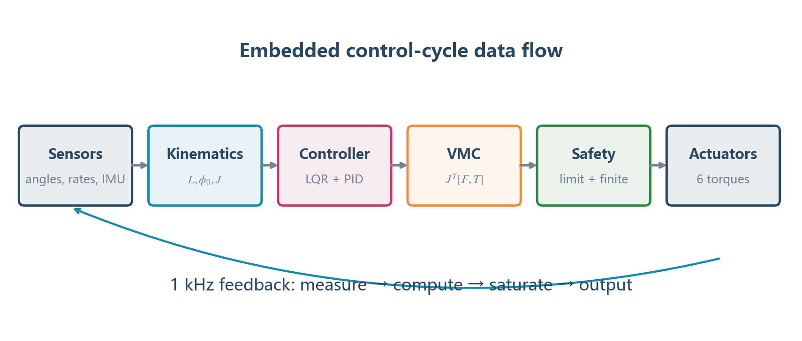

# 并联五连杆：从公式到可移植 C 代码

本文解决的不是“把公式抄成 C”这么简单，而是四个工程问题：计算顺序怎样确定、每个数学量存在哪里、浮点异常怎样阻断、控制算法怎样与用户自己的 PID/电机驱动解耦。

对应推导见：[01_并联五连杆公式完整推导.md](./01_并联五连杆公式完整推导.md)。



## 1. 先定模块边界

推荐把可移植算法限制为纯 C 数值模块：

```text
application / RTOS task
  ├─ 读取编码器、IMU、轮速、接触估计
  ├─ 填充 WlcInput / WlcCommand
  ├─ 调用 Wlc_Step()
  └─ 把 WlcOutput 交给电机驱动
                 │
                 ▼
portable control core
  ├─ five_bar kinematics
  ├─ state feedback / gain schedule
  ├─ external PID ports
  ├─ VMC projection
  └─ safety / saturation / diagnostics
```

算法核心不要直接引用：HAL、FreeRTOS、CAN、DJI 电机类型、板级定时器或全局传感器对象。它只接收数值结构体并返回数值结构体。这样迁移到 STM32、ESP32、Linux 或仿真时只需重写外层适配器。

## 2. 数学量到 C 变量的映射

| 数学符号 | C 名称 | 单位 | 来源 |
|---|---|---:|---|
| `l1` | `thigh_length_m` | m | 配置 |
| `l2` | `calf_length_m` | m | 配置 |
| `d` | `joint_distance_m` | m | 配置 |
| `phi1` | `p[PHI1]` | rad | 后髋编码器 |
| `phi4` | `p[PHI4]` | rad | 前髋编码器 |
| `phi2,phi3` | `p[PHI2]`,`p[PHI3]` | rad | 闭链计算 |
| `L` | `p[LEG_LENGTH]` | m | 虚拟腿计算 |
| `phi0` | `p[PHI0]` | rad | 虚拟腿计算 |
| `theta` | `p[THETA]` | rad | `phi0-pi/2-pitch` |
| `Jij` | `p[J11]` 等 | 混合单位 | 雅可比 |
| `F` | `p[SUPPORT_FORCE]` | N | 腿长控制 |
| `T` | `p[HIP_TORQUE]` | N·m | LQR/MPC |
| `tau1,tau4` | `back`,`front` | N·m | `J^T[F,T]` |

当前工程为减少小型 MCU 上的结构体嵌套开销，在内部使用枚举索引数组；公开 API 仍使用具名结构体。若平台内存充足，内部也可以改成具名结构体，公式不受影响。

## 3. 配置与输入输出结构体

一个可移植接口至少需要以下信息：

```c
typedef struct {
    float sample_time_s;
    float thigh_length_m;
    float calf_length_m;
    float joint_distance_m;
    float wheel_distance_m;
    float body_mass_kg;
    float min_leg_length_m;
    float max_leg_length_m;
    float wheel_torque_limit_nm;
    float joint_torque_limit_nm;
    float lqr_coefficients[12][4];
    float mpc_coefficients[12][4];
} WlcConfig;

typedef struct {
    float time_s;
    float pitch_rad, pitch_rate_rad_s;
    float roll_rad, yaw_rad, yaw_rate_rad_s;
    float distance_m, velocity_m_s;
    float joint_angle_rad[4];
    float joint_rate_rad_s[4];
    float normal_force_n[2];
} WlcInput;

typedef struct {
    float velocity_m_s;
    float yaw_rate_rad_s;
    float leg_length_m;
    unsigned mode_flags;
} WlcCommand;

typedef struct {
    float wheel_torque_nm[2];
    float joint_torque_nm[4];
    unsigned status_flags;
} WlcOutput;
```

不要把角度单位交给调用者猜。字段名中写出 `_rad`、`_deg`；算法核心只接受 rad。长度和力矩也在字段名中标单位，能减少移植时最难排查的比例错误。

## 4. 公式 (2)：闭链根号怎样写成 C

推导中的定义：

$$
\Delta x=x_D-x_B,\quad \Delta y=y_D-y_B,
$$

$$
S=(\Delta x)^2+(\Delta y)^2,
$$

$$
A_0=2l_2\Delta x,\quad B_0=2l_2\Delta y,
$$

$$
R_c=A_0^2+B_0^2-S^2.
$$

对应 C：

```c
float dx, dy, distance2, a0, b0, root2;

dx = xD - xB;
dy = yD - yB;
distance2 = dx*dx + dy*dy;       /* S，注意它是距离平方 */
a0 = 2.0f * calf_length * dx;
b0 = 2.0f * calf_length * dy;
root2 = a0*a0 + b0*b0 - distance2*distance2;

if (!isfinite(root2) || root2 <= ROOT_EPSILON) {
    return WLC_KINEMATICS_UNREACHABLE;
}

phi2 = 2.0f * atan2f(
    b0 + sqrtf(root2),            /* 此处固定装配分支 */
    a0 + distance2
);
```

### 4.1 为什么不用 `powf(x,2)`

`x*x` 的含义直接、通常更快，也更容易看出公式中的平方层级。尤其 `distance2*distance2` 表示 `S^2`，如果变量仍叫 `BD`，很容易误以为只平方了一次。推荐名称 `distance2` 或 `bd_squared`。

### 4.2 为什么根号前必须检查

对负数调用 `sqrtf` 会产生 NaN。NaN 进入后续 `sinf/cosf` 后，六路力矩都可能变成 NaN。电机驱动对 NaN 的限幅行为并不统一，因此算法核心必须在第一次发现不可达构型时返回错误并把输出清零。

### 4.3 装配分支不能在线跳变

`+sqrt` 和 `-sqrt` 对应两个闭链姿态。分支应由 CAD 和编码器零位确定。若需要自动识别，可以在上电未使能时同时计算两个解，再选择满足以下条件的一支：

- C 位于髋部下方；
- B、D 膝关节方向符合机械结构；
- 与上一帧角度差最小；
- 所有机械限位满足。

电机使能后不允许跨分支。

## 5. 公式 (3)～(7)：位置与虚拟腿

```c
xC = xB + calf_length * cosf(phi2);
yC = yB + calf_length * sinf(phi2);
phi3 = atan2f(yC - yD, xC - xD);

x_relative = xC - 0.5f * joint_distance;
leg_length = sqrtf(x_relative*x_relative + yC*yC);
if (!isfinite(leg_length) || leg_length < LENGTH_EPSILON) {
    return WLC_KINEMATICS_INVALID;
}

phi0 = atan2f(yC, x_relative);
theta = phi0 - 0.5f*WLC_PI - pitch;
```

这里的执行顺序有依赖关系：`phi3` 依赖 C，`L/phi0` 依赖 C，`theta` 又依赖 `phi0` 和 IMU pitch。不能为了“代码短”把这些表达式压成一行，否则调试时无法判断错误发生在哪一级。

## 6. 公式 (17)：雅可比怎样安全实现

先计算重复使用的三角项：

```c
float s32 = sinf(phi3 - phi2);
float s12 = sinf(phi1 - phi2);
float s34 = sinf(phi3 - phi4);
float s03 = sinf(phi0 - phi3);
float c03 = cosf(phi0 - phi3);
float s02 = sinf(phi0 - phi2);
float c02 = cosf(phi0 - phi2);
```

再做分母保护：

```c
if (!isfinite(s32) || fabsf(s32) < SIN_GUARD) {
    return WLC_KINEMATICS_SINGULAR;
}

float inv_s32 = 1.0f / s32;
float inv_L = 1.0f / leg_length;
```

最后逐项对应公式：

```c
J11 = thigh_length * s03 * s12 * inv_s32;
J12 = thigh_length * s02 * s34 * inv_s32;
J21 = thigh_length * c03 * s12 * inv_s32 * inv_L;
J22 = thigh_length * c02 * s34 * inv_s32 * inv_L;
```

### 6.1 单位检查

- `J11,J12`：`Ldot / angle_rate`，单位 m；
- `J21,J22`：`phi0dot / angle_rate`，角度用 rad 时量纲为 1；
- `J11*F`：m·N=N·m；
- `J21*T`：1·N·m=N·m。

若某一项单位无法得到 N·m，通常是把长度、角度或雅可比的行顺序弄错了。

## 7. 公式 (18)～(20)：速度与差分滤波

编码器已经提供主动关节速度时：

```c
leg_rate = J11*phi1_rate + J12*phi4_rate;
phi0_rate = J21*phi1_rate + J22*phi4_rate;
theta_rate = phi0_rate - pitch_rate;
```

若还需要加速度，不建议直接裸差分：

```c
float raw_accel = (leg_rate - last_leg_rate) / dt;
leg_accel = alpha*raw_accel + (1.0f-alpha)*leg_accel;
last_leg_rate = leg_rate;
```

这是一阶低通后的差分，其中 `alpha` 不是固定魔法数字。给定期望截止频率 `fc` 和采样周期 `dt`，可以使用：

$$
\tau_f=\frac{1}{2\pi f_c},\qquad
\alpha=\frac{dt}{\tau_f+dt}. \tag{1}
$$

当前工程为了与参考实现一致保留了经验系数。移植到不同采样率时必须重新计算，不能原样使用。

## 8. 公式 (26)、(27)：VMC 代码

数学式：

$$
\tau_1=J_{11}F+J_{21}T,
\qquad
\tau_4=J_{12}F+J_{22}T.
$$

C 实现：

```c
static void project_vmc(const LegState *leg,
                        float support_force_n,
                        float virtual_torque_nm,
                        float *tau_back_nm,
                        float *tau_front_nm)
{
    *tau_back_nm = leg->j11*support_force_n
                 + leg->j21*virtual_torque_nm;
    *tau_front_nm = leg->j12*support_force_n
                  + leg->j22*virtual_torque_nm;
}
```

不要在这个函数中加入 PID、重力补偿或 CAN 输出。它只实现雅可比转置映射，才容易单元测试和移植。

## 9. 把自己的 PID 接进来

算法核心不应规定用户必须使用哪一种 PID 结构体。使用函数指针端口：

```c
typedef float (*WlcPidCalculateFn)(void *instance,
                                   float measurement,
                                   float reference);
typedef void (*WlcPidResetFn)(void *instance);

typedef struct {
    void *instance;
    WlcPidCalculateFn calculate;
    WlcPidResetFn reset;
} WlcPidPort;
```

用户 PID 适配器：

```c
typedef struct {
    float kp, ki, kd;
    float integral;
    float previous_error;
    float output_limit;
    /* 这里可以继续放变积分、微分先行、死区等自有功能。 */
} MyPid;

static float my_pid_adapter(void *instance,
                            float measurement,
                            float reference)
{
    MyPid *pid = (MyPid *)instance;
    return MyPid_Calculate(pid, measurement, reference);
}

static void my_pid_reset_adapter(void *instance)
{
    MyPid_Reset((MyPid *)instance);
}
```

初始化时绑定：

```c
Wlc_BindPid(&controller, WLC_PID_LEFT_LENGTH,
            &left_length_pid,
            my_pid_adapter,
            my_pid_reset_adapter);

Wlc_BindPid(&controller, WLC_PID_LEFT_SPEED,
            &left_speed_pid,
            my_pid_adapter,
            my_pid_reset_adapter);
```

控制器调用：

```c
velocity_reference = Wlc_CallPid(
    ctx, WLC_PID_LEFT_LENGTH,
    measured_leg_length,
    commanded_leg_length
);

support_force = Wlc_CallPid(
    ctx, WLC_PID_LEFT_SPEED,
    measured_leg_rate,
    velocity_reference
);
```

这种设计允许 PID 结构体、内部功能和参数完全属于用户工程；生产代码只知道 `void*` 和调用函数，不需要引用用户 PID 头文件。

## 10. 离散 PID 的完整对应关系

若需要自己实现一个基线版本，误差定义为：

$$
e_k=r_k-y_k. \tag{2}
$$

位置式 PID：

$$
I_k=\operatorname{clip}(I_{k-1}+K_i e_kT_s,I_{min},I_{max}), \tag{3}
$$

$$
D_k=-K_d\frac{y_k-y_{k-1}}{T_s}, \tag{4}
$$

$$
u_k=\operatorname{clip}(K_pe_k+I_k+D_k,u_{min},u_{max}). \tag{5}
$$

式 (4) 对测量值微分，可避免设定值跳变产生微分冲击。基础 C：

```c
float Pid_Step(Pid *p, float measurement, float reference)
{
    float error = reference - measurement;
    float derivative = -(measurement - p->last_measurement) / p->dt;
    float candidate = p->integral + p->ki*error*p->dt;
    candidate = clipf(candidate, -p->integral_limit, p->integral_limit);

    float unsaturated = p->kp*error + candidate + p->kd*derivative;
    float output = clipf(unsaturated, -p->output_limit, p->output_limit);

    /* 条件积分：饱和且误差继续推向饱和方向时不更新积分。 */
    if (output == unsaturated || output*error < 0.0f) {
        p->integral = candidate;
    }
    p->last_measurement = measurement;
    return output;
}
```

这只是接口示例。若已有更完善的 PID，应通过上一节的端口绑定，而不是替换便携核心的文件。

## 11. 腿长串级控制到支撑力

第一层把长度误差变成速度指令：

```c
velocity_reference = LengthPid(measured_length, target_length);
velocity_reference = clipf(velocity_reference, -MAX_LEG_SPEED, MAX_LEG_SPEED);
```

第二层把速度误差变成反馈力：

```c
feedback_force = SpeedPid(measured_leg_rate, velocity_reference);
feedback_force = clipf(feedback_force, -MAX_FORCE, MAX_FORCE);
```

加入重力前馈：

```c
support_force = feedback_force + equivalent_mass_kg*9.81f;
```

再加入横滚差动力或动态补偿，最后才进入 VMC。这样每一层都能独立记录：目标长度、实际长度、目标速度、实际速度、反馈力、前馈力和最终力。

## 12. LQR 增益调度怎样写成高效 C

每个增益元素用三次多项式：

$$
k(L)=aL^3+bL^2+cL+d.
$$

不要在线计算 `powf`。Horner 形式：

```c
static float scheduled_gain(const float c[4], float length)
{
    return ((c[0]*length + c[1])*length + c[2])*length + c[3];
}
```

六状态误差：

```c
error[0] = -theta;
error[1] = -theta_rate;
error[2] = target_distance - distance;
error[3] = target_velocity - velocity;
error[4] = -pitch;
error[5] = -pitch_rate;
```

两路控制量累加：

```c
float command[2] = {0.0f, 0.0f};

for (uint32_t output = 0; output < 2; ++output) {
    for (uint32_t state = 0; state < 6; ++state) {
        uint32_t index = output*6 + state;
        float k = scheduled_gain(coefficients[index], leg_length);
        command[output] += k*error[state];
    }
}

wheel_torque = command[0];
virtual_hip_torque = command[1];
```

工程使用 `error=reference-state`，因此代码是正号累加；教科书常写 `u=-Kx`。两者在误差定义一致时等价，不能只看到符号不同就修改。

## 13. 从连续模型生成离散增益

增益生成放在 PC 离线完成，MCU 只执行多项式。流程：

1. 对每个腿长 `L_i` 计算连续 `A(L_i),B(L_i)`；
2. 以采样周期 `Ts` 离散化得到 `Ad,Bd`；
3. 离散化二次型代价，得到 `Qd,Rd,Nd`；
4. 解离散 Riccati 方程；
5. 得到 `K_i`，检查 `Ad-Bd*K_i` 的全部特征值模小于 1；
6. 对 12 个增益元素分别做三次多项式拟合；
7. 在整个允许腿长范围密集采样，重新检查拟合后闭环稳定性；
8. 导出只读 C 数组。

离散系统的带交叉项代价为：

$$
J=\sum_{k=0}^{\infty}
(x_k^TQ_dx_k+2x_k^TN_du_k+u_k^TR_du_k). \tag{6}
$$

对应增益：

$$
K=(R_d+B_d^TPB_d)^{-1}(B_d^TPA_d+N_d^T). \tag{7}
$$

不要在 C 中显式求矩阵逆。DARE 求解器应通过线性方程分解求解；在线控制器则只使用已经导出的系数。

## 14. 力矩限幅的正确位置

顺序应为：

```text
PID/LQR 得到 F、T
       ↓
Jᵀ 映射得到 tau1、tau4
       ↓
关节力矩限幅
       ↓
电机力矩 → 电流换算
       ↓
驱动器电流限幅
```

关节力矩限幅必须在 VMC 后进行，因为 `F/T` 的矩形限幅不能准确代表两个电机各自的力矩边界。限幅：

```c
tau1 = clipf(tau1, -joint_torque_limit, joint_torque_limit);
tau4 = clipf(tau4, -joint_torque_limit, joint_torque_limit);
```

电流换算需要电机转矩常数 `Kt`、减速比 `i` 和效率 `eta`：

$$
I=\frac{\tau_{joint}}{K_t i\eta}. \tag{8}
$$

这些参数属于电机适配层，不应写进机构运动学。

## 15. 一个控制周期的推荐伪代码

```c
int Wlc_Step(Context *ctx,
             const WlcInput *input,
             const WlcCommand *command,
             WlcOutput *output)
{
    zero_output(output);                    /* 失败默认零力 */
    if (!valid_input(input, command)) return INPUT_INVALID;

    update_command_ramp(ctx, command);       /* 限加速度目标 */

    for (side = 0; side < 2; ++side) {
        load_joint_measurements(ctx, input, side);
        if (five_bar_to_virtual(ctx, input, side) != OK)
            return KINEMATICS_INVALID;
        compute_scheduled_feedback(ctx, input, side);
    }

    compute_yaw_and_anti_split(ctx, input);

    for (side = 0; side < 2; ++side) {
        compute_leg_length_cascade(ctx, command, side);
        add_gravity_and_roll_feedforward(ctx, input, side);
        project_vmc(ctx, side);
        saturate_joint_torques(ctx, output, side);
    }

    if (!all_finite(output)) {
        zero_output(output);
        return NUMERIC_INVALID;
    }
    return OK;
}
```

`zero_output` 放在函数入口的原因是：任何中途返回都不会遗留上一周期力矩。

## 16. 数值与实时性规则

### 16.1 每周期必须检查

- 所有输入为有限数；
- `root2>epsilon`；
- `L` 位于可接受范围；
- `|sin(phi3-phi2)|>SIN_GUARD`；
- 所有最终输出为有限数；
- 零力模式、失联、IMU 异常时输出清零。

### 16.2 避免动态内存

控制周期内不使用 `malloc/free`、可变长度数组、文件 IO 或日志格式化。上下文、配置、输入输出由调用者静态分配。

### 16.3 使用 `float` 还是 `double`

Cortex-M4F/M7F 单精度通常更高效。几何长度约 0.1 m、控制频率 1 kHz 时 `float` 可以满足当前精度；离线 Riccati、矩阵指数和多项式拟合使用 `double`，导出时再量化为 `float` 并复验闭环特征值。

### 16.4 三角函数次数

每个角差只计算一次 `sinf/cosf` 并复用。不要为了手写“优化”引入低精度查表，除非已经测得三角函数成为时间瓶颈，并且查表误差通过闭环测试。

## 17. 测试：先验证数学，再接电机

### 17.1 闭链长度测试

随机生成安全范围内的 `phi1,phi4`，求 C 后检查：

$$
|\|C-B\|-l_2|<\epsilon,
\qquad
|\|C-D\|-l_2|<\epsilon. \tag{9}
$$

### 17.2 雅可比数值差分

令 `q=[phi1,phi4]`，小量 `h`：

$$
J_{num}[:,i]=\frac{f(q+h e_i)-f(q-h e_i)}{2h}, \tag{10}
$$

其中 `f(q)=[L,phi0]^T`。比较 `Jnum` 与解析式 (17)。角度差必须先归一化到 `[-pi,pi]`，避免跨 `atan2` 分支时出现 `2pi` 假跳变。

### 17.3 功率一致性

随机选 `qdot,F,T`：

```c
virtual_rate = J * joint_rate;
joint_torque = transpose(J) * virtual_force;

power_virtual = F*L_rate + T*phi0_rate;
power_motor = tau1*phi1_rate + tau4*phi4_rate;
```

检查：

$$
|P_{virtual}-P_{motor}|<\epsilon_P. \tag{11}
$$

这是检查 VMC 行列顺序和正负号最有效的测试之一。

### 17.4 边界测试

必须覆盖：

- 两圆不相交；
- 两圆相切；
- `phi2≈phi3`；
- `L` 过短、过长；
- 输入包含 NaN/Inf；
- 力矩超过限幅；
- 零力、失联和重置；
- 左右腿编码器方向不同的适配。

## 18. 实物接入顺序

1. PC 单元测试通过闭链、雅可比和功率一致性；
2. MCU 只接传感器、不使能电机，串口观察 `phi/L/J`；
3. 机架悬空，单个电机小电流验证正方向；
4. 悬空双髋，给很小的 `F`，确认腿沿预期方向伸缩；
5. 给很小的 `T`，确认虚拟腿按预期摆动；
6. 低支撑架落地，只开腿长 PID 和重力前馈；
7. 再开俯仰 LQR，逐步提高轮和关节力矩限幅；
8. 最后验证横滚、航向、跳跃和失效保护。

任何一步方向错误，都应回到坐标入口或功率测试定位，不要通过同时翻转多个 PID 参数来“试到能站”。

## 19. 当前工程可直接参考的实现

- 独立五连杆运动学：`WheelLeg_LQR/portable_control/kinematics/five_bar.h`
- VMC、LQR 调度、PID 端口：`WheelLeg_LQR/portable_control/wlc.c`
- 对外 API：`WheelLeg_LQR/portable_control/wlc.h`
- Python 几何对照：`WheelLeg_LQR/simulation/five_bar.py`
- 离线增益生成：`WheelLeg_LQR/simulation/source_design.py`

生产代码导出器会把所选腿型的运动学复制为单独的 `wlc_kinematics.h`。五连杆代码包不会包含串联腿公式，也不需要 MuJoCo、Python、HAL 或 RTOS。

