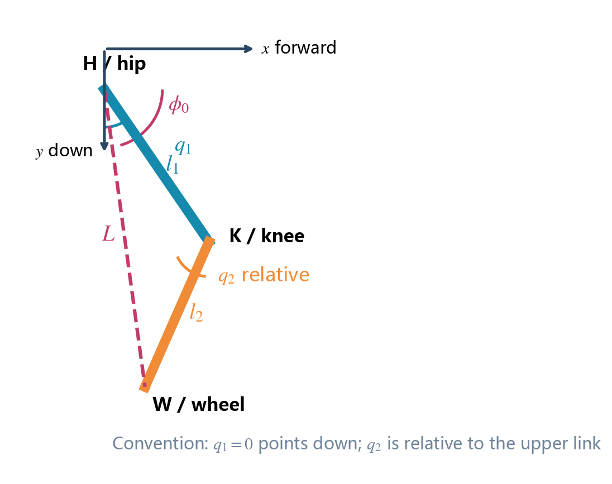
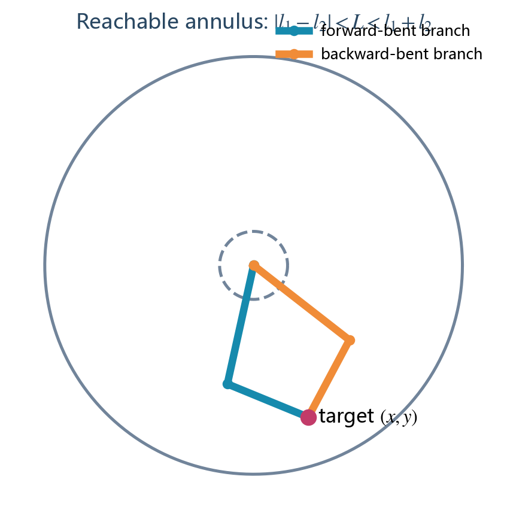
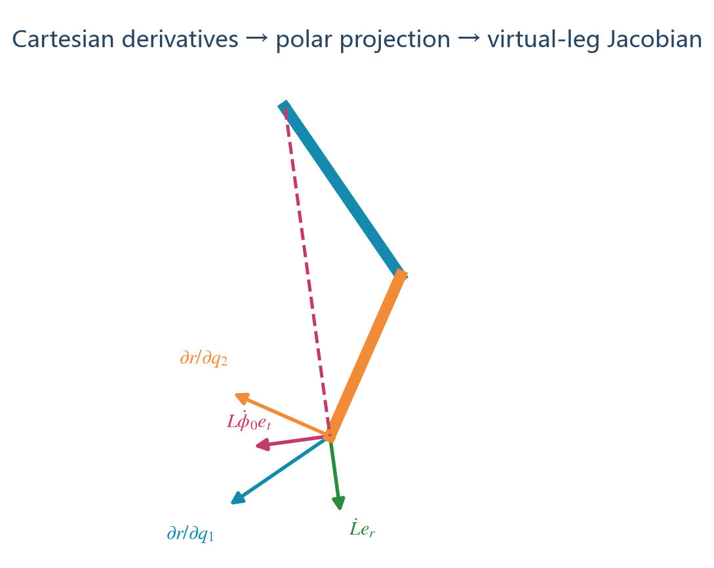

# 串联二连杆腿公式完整推导

本文推导平面髋—膝二关节串联腿。推导采用当前工程串联腿 C 代码的角度约定，而不是直接套用机械臂教材常见的“从 `+x` 轴测绝对角”公式。先统一约定可以避免正弦、余弦互换以及膝关节相对角被误当成绝对角。



## 1. 机构、坐标与角度约定

- H：髋关节，是第一主动关节；
- K：膝关节，是第二主动关节；
- W：轮轴中心，也是虚拟腿末端；
- HK：大腿，长度 `l1`；
- KW：小腿，长度 `l2`；
- 原点位于 H，`+x` 向前，`+y` 向下；
- `q1`：髋关节角，`q1=0` 时大腿竖直向下；
- `q2`：膝关节相对角，小腿绝对角为 `q1+q2`；
- 所有角度内部单位为 rad。

### 1.1 符号表

| 符号 | 单位 | 定义 | 来源 |
|---|---:|---|---|
| `l1` | m | 大腿 HK 长度 | 结构参数 |
| `l2` | m | 小腿 KW 长度 | 结构参数 |
| `q1` | rad | 髋角，零位向下 | 髋编码器 |
| `q2` | rad | 膝相对角 | 膝编码器 |
| `q12=q1+q2` | rad | 小腿绝对角 | 计算量 |
| `(x,y)` | m | W 相对 H 的坐标 | 正运动学 |
| `L` | m | 虚拟腿 HW 长度 | 计算量 |
| `phi0` | rad | HW 相对 `+x` 的角 | 计算量 |
| `pitch` | rad | 机身俯仰角 | IMU |
| `theta` | rad | 虚拟腿相对世界竖直的倾角 | 控制状态 |
| `F` | N | 沿 L 的虚拟支撑力 | 腿长控制器 |
| `T` | N·m | 改变 `phi0` 的虚拟髋力矩 | 平衡控制器 |
| `tau1,tau2` | N·m | 髋、膝电机力矩 | VMC 输出 |

## 2. 正运动学：从关节角求轮轴位置

### 2.1 大腿端点 K

`q1=0` 指向 `+y`，因此本坐标中的杆向量是：

$$
\mathbf r_{HK}=l_1
\begin{bmatrix}\sin q_1\\\cos q_1\end{bmatrix}. \tag{1}
$$

**依据：[解析几何] 极坐标分解。**

所以：

$$
x_K=l_1\sin q_1,
\qquad
y_K=l_1\cos q_1. \tag{2}
$$

当 `q1=0` 时，式 (2) 给出 `(xK,yK)=(0,l1)`，与“零位向下”的定义一致。这是最先要做的符号检查。

### 2.2 小腿向量 KW

膝角 `q2` 是相对大腿的转角，所以小腿绝对角为：

$$
q_{12}=q_1+q_2. \tag{3}
$$

小腿向量：

$$
\mathbf r_{KW}=l_2
\begin{bmatrix}\sin(q_1+q_2)\\\cos(q_1+q_2)\end{bmatrix}. \tag{4}
$$

### 2.3 轮轴 W

串联机构的位置向量相加：

$$
\mathbf r_{HW}=\mathbf r_{HK}+\mathbf r_{KW}. \tag{5}
$$

展开得到：

$$
\boxed{x=l_1\sin q_1+l_2\sin(q_1+q_2)}, \tag{6}
$$

$$
\boxed{y=l_1\cos q_1+l_2\cos(q_1+q_2)}. \tag{7}
$$

式 (6)、(7) 是串联腿 C 实现的起点。它与常见机械臂公式中的 `x=l1 cos+l2 cos` 不同，原因是本文角度从竖直向下测量。

## 3. 虚拟腿长度与角度

**依据：[解析几何] 二维向量长度。**

$$
\boxed{L=\sqrt{x^2+y^2}}. \tag{8}
$$

虚拟腿相对 `+x` 的方向：

$$
\boxed{\phi_0=\operatorname{atan2}(y,x)}. \tag{9}
$$

竖直向下时 `(x,y)=(0,L)`，因此 `phi0=pi/2`。定义相对世界竖直的控制角：

$$
\boxed{\theta=\phi_0-\frac{\pi}{2}-pitch}. \tag{10}
$$

式 (10) 与五连杆虚拟腿定义保持一致，因此上层 LQR、腿长 PID 和 VMC 接口可以复用；不同腿型只替换“关节角到 `L/phi0/J`”的运动学模块。

## 4. 逆运动学：从目标轮轴位置求关节角



逆运动学用于生成初始姿态、机械限位和期望构型。实时 VMC 使用编码器正运动学，不依赖逆解。

### 4.1 可达范围

H、K、W 构成边长为 `l1,l2,L` 的三角形。**依据：[解析几何] 三角形两边之和大于第三边。**

$$
\boxed{|l_1-l_2|\le L\le l_1+l_2}. \tag{11}
$$

工程中应使用严格不等式并留安全余量，因为两个等号位置都是共线奇异构型：

$$
|l_1-l_2|+\delta_L<L<l_1+l_2-\delta_L. \tag{12}
$$

### 4.2 用余弦定理求膝角

**依据：[余弦定理]。**

由式 (6)、(7)：

$$
\begin{aligned}
L^2&=x^2+y^2\\
&=l_1^2+l_2^2+2l_1l_2\cos q_2.
\end{aligned} \tag{13}
$$

移项：

$$
\boxed{
\cos q_2=\frac{L^2-l_1^2-l_2^2}{2l_1l_2}
}. \tag{14}
$$

因此：

$$
\boxed{
q_2=\pm\arccos\left(\frac{L^2-l_1^2-l_2^2}{2l_1l_2}\right)
}. \tag{15}
$$

正负号对应膝盖向前/向后的两个分支。机构设计和编码器零位必须固定其中一支。

浮点计算中，式 (14) 的结果可能因舍入成为 `1+1e-7`。确认目标处于可达范围后，可以将余弦值夹到 `[-1,1]`；若超出量较大，应报告不可达，不能无条件夹紧掩盖错误。

### 4.3 求髋角

定义目标向量相对竖直向下的角：

$$
\alpha=\operatorname{atan2}(x,y). \tag{16}
$$

把式 (6)、(7)按 `q1` 展开：

$$
x=(l_1+l_2\cos q_2)\sin q_1+l_2\sin q_2\cos q_1, \tag{17}
$$

$$
y=(l_1+l_2\cos q_2)\cos q_1-l_2\sin q_2\sin q_1. \tag{18}
$$

式 (17)、(18)表示向量 `[x,y]` 是长度分量
`[l2 sin(q2), l1+l2 cos(q2)]` 旋转 `q1` 后的结果。因此内部偏角：

$$
\beta=\operatorname{atan2}
\left(l_2\sin q_2,l_1+l_2\cos q_2\right). \tag{19}
$$

目标方向满足 `alpha=q1+beta`，所以：

$$
\boxed{
q_1=\alpha-\operatorname{atan2}
\left(l_2\sin q_2,l_1+l_2\cos q_2\right)
}. \tag{20}
$$

当目标竖直向下时 `x=0,y=L`，`alpha=0`，当前工程采用正膝角分支：

$$
q_1=-\operatorname{atan2}
\left(l_2\sin q_2,l_1+l_2\cos q_2\right). \tag{21}
$$

## 5. 笛卡尔速度雅可比



定义：

$$
\mathbf q=\begin{bmatrix}q_1\\q_2\end{bmatrix},
\qquad
\mathbf r=\begin{bmatrix}x\\y\end{bmatrix}.
$$

**依据：[链式法则] 对式 (6)、(7)分别对关节角求偏导。**

对 `q1`：

$$
\frac{\partial x}{\partial q_1}
=l_1\cos q_1+l_2\cos(q_1+q_2)=y, \tag{22}
$$

$$
\frac{\partial y}{\partial q_1}
=-l_1\sin q_1-l_2\sin(q_1+q_2)=-x. \tag{23}
$$

对 `q2`：

$$
\frac{\partial x}{\partial q_2}=l_2\cos(q_1+q_2), \tag{24}
$$

$$
\frac{\partial y}{\partial q_2}=-l_2\sin(q_1+q_2). \tag{25}
$$

所以笛卡尔雅可比：

$$
\boxed{
J_{xy}=\frac{\partial(x,y)}{\partial(q_1,q_2)}=
\begin{bmatrix}
y&l_2\cos(q_1+q_2)\\
-x&-l_2\sin(q_1+q_2)
\end{bmatrix}
}. \tag{26}
$$

轮轴速度：

$$
\begin{bmatrix}\dot x\\\dot y\end{bmatrix}
=J_{xy}
\begin{bmatrix}\dot q_1\\\dot q_2\end{bmatrix}. \tag{27}
$$

## 6. 从笛卡尔速度转为虚拟腿速度

上层控制需要 `[Ldot,phi0dot]`，不是 `[xdot,ydot]`。

### 6.1 腿长速度

由 `L=sqrt(x^2+y^2)`，**依据：[链式法则]**：

$$
\dot L=\frac{x\dot x+y\dot y}{L}. \tag{28}
$$

对任意关节 `qi`：

$$
\boxed{
\frac{\partial L}{\partial q_i}
=\frac{x\dfrac{\partial x}{\partial q_i}
+y\dfrac{\partial y}{\partial q_i}}{L}
}. \tag{29}
$$

### 6.2 虚拟腿角速度

由 `phi0=atan2(y,x)`，其全微分为：

$$
d\phi_0=\frac{x\,dy-y\,dx}{x^2+y^2}. \tag{30}
$$

因此：

$$
\boxed{
\frac{\partial\phi_0}{\partial q_i}
=\frac{x\dfrac{\partial y}{\partial q_i}
-y\dfrac{\partial x}{\partial q_i}}{L^2}
}. \tag{31}
$$

把式 (22)～(25)代入，定义：

$$
d_{x1}=y,\quad d_{y1}=-x,\quad
d_{x2}=l_2\cos(q_1+q_2),\quad
d_{y2}=-l_2\sin(q_1+q_2). \tag{32}
$$

虚拟腿雅可比：

$$
\boxed{
J=\begin{bmatrix}
\dfrac{xd_{x1}+yd_{y1}}{L}&
\dfrac{xd_{x2}+yd_{y2}}{L}\\[10pt]
\dfrac{xd_{y1}-yd_{x1}}{L^2}&
\dfrac{xd_{y2}-yd_{x2}}{L^2}
\end{bmatrix}
}. \tag{33}
$$

所以：

$$
\boxed{
\begin{bmatrix}\dot L\\\dot\phi_0\end{bmatrix}
=J\begin{bmatrix}\dot q_1\\\dot q_2\end{bmatrix}
}. \tag{34}
$$

并且：

$$
\boxed{\dot\theta=\dot\phi_0-\dot{pitch}}. \tag{35}
$$

### 6.3 第一列为什么出现简化

根据式 (32)，`dx1=y,dy1=-x`。代入式 (29)：

$$
J_{11}=\frac{xy+y(-x)}{L}=0. \tag{36}
$$

这不是计算错误。`q1` 单独变化时整条腿绕髋旋转，H 到 W 的距离不变，因此它只改变虚拟腿方向，不改变长度。

同理：

$$
J_{21}=\frac{x(-x)-y(y)}{L^2}=-1. \tag{37}
$$

负号来自本文 `phi0=atan2(y,x)` 与 `q1` 零位向下的组合。若实物编码器正方向相反，应在传感器适配层转换，而不是删除这个负号。

## 7. 串联腿奇异性


先计算笛卡尔雅可比行列式：

$$
\begin{aligned}
\det(J_{xy})
&=\frac{\partial x}{\partial q_1}
\frac{\partial y}{\partial q_2}
-\frac{\partial x}{\partial q_2}
\frac{\partial y}{\partial q_1}\\
&=-l_1l_2\sin q_2.
\end{aligned} \tag{38}
$$

因此：

$$
\boxed{\sin q_2=0\quad\Longrightarrow\quad q_2=k\pi}. \tag{39}
$$

对应两种共线状态：

- `q2≈0`：两杆完全伸直，`L≈l1+l2`；
- `q2≈pi`：两杆完全折叠，`L≈|l1-l2|`。

虚拟腿雅可比还含 `1/L` 和 `1/L^2`，因此必须同时检查：

$$
L>L_{guard},\qquad |\sin q_2|>s_{guard}. \tag{40}
$$

当前串联腿 C 模块已经检查 `L` 下限；用于实物时还应加入 `sin(q2)` 软保护和机械角限位，避免在接近共线处请求过大的端点力。

## 8. VMC：虚拟力映射到髋、膝力矩

虚拟广义力：

$$
\mathbf Q_v=\begin{bmatrix}F\\T\end{bmatrix}.
$$

**依据：[虚功原理] 理想关节与刚性杆不消耗功率。**

虚拟端功率：

$$
P_v=F\dot L+T\dot\phi_0. \tag{41}
$$

电机端功率：

$$
P_m=\tau_1\dot q_1+\tau_2\dot q_2. \tag{42}
$$

由式 (34)：

$$
P_v=\mathbf Q_v^TJ\dot{\mathbf q}
=(J^T\mathbf Q_v)^T\dot{\mathbf q}. \tag{43}
$$

要求所有允许速度下 `Pv=Pm`：

$$
\boxed{
\begin{bmatrix}\tau_1\\\tau_2\end{bmatrix}
=J^T\begin{bmatrix}F\\T\end{bmatrix}
}. \tag{44}
$$

展开：

$$
\boxed{\tau_1=J_{11}F+J_{21}T}, \tag{45}
$$

$$
\boxed{\tau_2=J_{12}F+J_{22}T}. \tag{46}
$$

由于 `J11=0`，理想二连杆模型中纯轴向支撑力主要通过膝关节产生髋/膝组合力矩；虚拟角力矩则通过两关节共同实现。实际电机力矩还受连杆重力、摩擦、减速器效率和关节惯量影响，可在 VMC 输出外加入经过验证的动力学前馈。

## 9. 支撑力与整车平衡控制

串联腿与五连杆共享虚拟接口 `[L,theta,Ldot,thetadot]`，因此上层控制结构相同：

1. 腿长外环产生 `Ldot_ref`；
2. 腿长速度内环产生支撑力 `Ffb`；
3. **[牛顿第二定律]** 加入重力前馈 `Fff=m_eq*g`；
4. LQR 根据虚拟腿和机身状态产生轮力矩与虚拟角力矩 `T`；
5. 式 (44) 把 `F/T` 投影为髋、膝力矩。

支撑力：

$$
F=F_{feedback}+m_{eq}g+F_{roll}+F_{dynamic}. \tag{47}
$$

状态向量仍可写为：

$$
\mathbf x=
\begin{bmatrix}
\theta&\dot\theta&x_b&\dot x_b&pitch&\dot{pitch}
\end{bmatrix}^T. \tag{48}
$$

控制律：

$$
\mathbf u=-K(L)\mathbf x,
\qquad
\mathbf u=\begin{bmatrix}T_{wheel}&T\end{bmatrix}^T. \tag{49}
$$

需要区分“接口能复用”和“增益可直接复用”：虚拟状态定义一致，所以软件接口可复用；若串联腿与五连杆的连杆质量、转动惯量、质心和执行器特性不同，整车 `A/B/K` 应按串联腿参数重新辨识或建模。当前工程默认增益来自现有虚拟腿集中参数模型，实物高功率运行前必须重新验证。

## 10. 公式自检

### 10.1 长度约束

正运动学结果应满足：

$$
\|K-H\|=l_1,\qquad \|W-K\|=l_2. \tag{50}
$$

### 10.2 正逆解闭环

对安全工作区内的 `(q1,q2)`：

```text
关节角 → 正运动学得到 (x,y)
      → 固定同一分支做逆运动学
      → 恢复原关节角（考虑 2π 归一化）
```

### 10.3 雅可比数值差分

令 `f(q)=[L,phi0]`，使用中心差分：

$$
J_{num}[:,i]=\frac{f(q+h e_i)-f(q-h e_i)}{2h}. \tag{51}
$$

比较式 (33) 与 `Jnum`。

### 10.4 功率一致性

随机选择 `qdot,F,T`：

$$
F\dot L+T\dot\phi_0
=\tau_1\dot q_1+\tau_2\dot q_2. \tag{52}
$$

式 (52) 同时检查雅可比行列顺序、转置和电机力矩符号。

## 11. 参考依据

1. Kevin M. Lynch, Frank C. Park, *Modern Robotics: Mechanics, Planning, and Control*, Cambridge University Press, 2017：串联机械臂正运动学、雅可比和静力映射。
2. John J. Craig, *Introduction to Robotics: Mechanics and Control*, 3rd ed., Pearson, 2005：二连杆平面机构、逆运动学分支。
3. 本工程 `portable_control/kinematics/serial_leg.h`：式 (6)～(10)、(32)～(35) 的目标实现。
4. 本工程 `simulation/mujoco_model.py` 中 `serial_angles`：竖直目标的逆运动学与机械限位生成。

