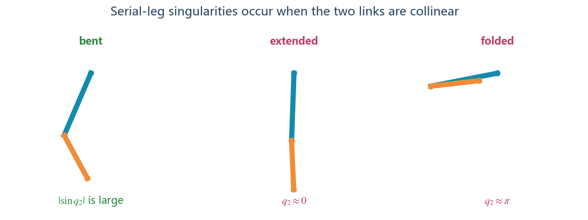

# 串联二连杆腿：从公式到可移植 C 代码

本文把 [03_串联腿公式完整推导.md](./03_串联腿公式完整推导.md) 的每个结果转换为嵌入式 C。重点是让串联腿包独立于五连杆公式，同时继续复用统一的 LQR、外部 PID、状态机和输入输出接口。

## 1. 独立代码包应是什么样

推荐导出结构：

```text
serial_leg_control/
├─ include/
│  ├─ wlc.h
│  └─ wlc_generated_params.h
├─ src/
│  ├─ wlc.c
│  └─ wlc_kinematics.h      # 只含串联腿公式
├─ examples/
│  └─ external_pid_example.c
├─ tests/
│  └─ self_test.c
└─ README.md
```

串联腿包不应包含：

- 五连杆闭链根号、`phi2/phi3` 或两圆交点；
- 运行时 `if (topology==...)`；
- MuJoCo、Python、HAL、RTOS 或特定电机库；
- 用户 PID 结构体的定义。

当前工程导出器已经按这个原则生成 `serial_leg_control`。

## 2. 输入顺序与旧字段名

统一 API 为了兼容两种腿型，仍有四个关节槽位：

| 数组索引 | 串联腿含义 | 五连杆历史含义 |
|---:|---|---|
| 0 | 左髋 `q1L` | 左后髋 `phi1L` |
| 1 | 左膝 `q2L` | 左前髋 `phi4L` |
| 2 | 右髋 `q1R` | 右后髋 `phi1R` |
| 3 | 右膝 `q2R` | 右前髋 `phi4R` |

串联腿运动学头文件内部暂时把髋角放在 `p[PHI1]`、膝角放在 `p[PHI4]`。这是内部数组的兼容名称，不代表串联腿有前后两个髋。新应用代码应只通过 `WlcInput.joint_angle_rad[]` 访问，不要依赖内部枚举。

## 3. 编码器原始值到 `q1/q2`

公式要求：`q1=0` 时大腿向下；`q2` 是小腿相对大腿的角。真实编码器一般需要零偏和方向转换：

$$
q_i=s_i(q_{raw,i}-q_{zero,i}),\qquad s_i\in\{-1,+1\}. \tag{1}
$$

速度：

$$
\dot q_i=s_i\dot q_{raw,i}. \tag{2}
$$

C 适配层：

```c
static float encoder_to_joint(float raw,
                              float zero,
                              float direction)
{
    return direction * (raw - zero);
}

input.joint_angle_rad[0] = encoder_to_joint(
    left_hip_encoder, LEFT_HIP_ZERO, LEFT_HIP_DIRECTION);
input.joint_angle_rad[1] = encoder_to_joint(
    left_knee_encoder, LEFT_KNEE_ZERO, LEFT_KNEE_DIRECTION);
```

若膝编码器测的是小腿绝对角 `q12`，必须先转换为相对角：

$$
q_2=q_{12}-q_1,qquad
\dot q_2=\dot q_{12}-\dot q_1. \tag{3}
$$

不能把绝对小腿角直接传给串联腿核心，否则公式中的 `q1+q2` 会重复加入髋角。

## 4. 公式 (6)、(7)：正运动学 C 实现

数学式：

$$
x=l_1\sin q_1+l_2\sin(q_1+q_2),
$$

$$
y=l_1\cos q_1+l_2\cos(q_1+q_2).
$$

C：

```c
float q1 = leg->hip_angle_rad;
float q2 = leg->knee_angle_rad;
float q12 = q1 + q2;

float s1 = sinf(q1);
float c1 = cosf(q1);
float s12 = sinf(q12);
float c12 = cosf(q12);

float x = config->thigh_length_m*s1
        + config->calf_length_m*s12;
float y = config->thigh_length_m*c1
        + config->calf_length_m*c12;
```

先保存 `q12/s1/c1/s12/c12`，避免后续雅可比重复调用三角函数。当前极简实现为了文件体积直接写 `sinf/cosf`，对性能敏感的 MCU 可以采用上面的复用形式。

### 4.1 最小几何测试

设置 `q1=0,q2=0`：

```text
x = 0
y = l1+l2
L = l1+l2
```

若测试得到 `x=l1+l2,y=0`，说明使用了从 `+x` 轴测角的另一套公式，必须统一坐标后再继续。

## 5. 公式 (8)～(10)：虚拟腿

```c
float length2 = x*x + y*y;
if (!isfinite(length2) || length2 <= LENGTH_GUARD*LENGTH_GUARD) {
    return WLC_KINEMATICS_INVALID;
}

float length = sqrtf(length2);
float inv_length = 1.0f / length;
float inv_length2 = 1.0f / length2;

float phi0 = atan2f(y, x);
float theta = phi0 - 0.5f*WLC_PI - pitch_rad;
```

不要先算 `1/length` 再检查 length。IEEE 浮点除零可能产生 Inf 而不中断程序，Inf 进入力矩映射后会污染输出。

## 6. 公式 (22)～(26)：笛卡尔偏导

推导结果：

$$
d_{x1}=y,\quad d_{y1}=-x,
$$

$$
d_{x2}=l_2\cos(q_1+q_2),\quad
d_{y2}=-l_2\sin(q_1+q_2).
$$

C：

```c
float dx1 = y;
float dy1 = -x;
float dx2 = config->calf_length_m*c12;
float dy2 = -config->calf_length_m*s12;
```

这里的 `dx1=y,dy1=-x` 是旋转向量的结果：髋关节转动会让整个末端向量绕 H 转动 90°。保留这个写法比重新展开多项正弦余弦更短，也减少运算。

## 7. 公式 (33)：虚拟腿雅可比

```c
leg->j11 = (x*dx1 + y*dy1) * inv_length;
leg->j12 = (x*dx2 + y*dy2) * inv_length;

leg->j21 = (x*dy1 - y*dx1) * inv_length2;
leg->j22 = (x*dy2 - y*dx2) * inv_length2;
```

对应关系：

| C 变量 | 数学意义 | 单位 |
|---|---|---:|
| `j11` | `dL/dq1` | m |
| `j12` | `dL/dq2` | m |
| `j21` | `dphi0/dq1` | 1 |
| `j22` | `dphi0/dq2` | 1 |

### 7.1 可选的解析自检

理论上 `j11=0,j21=-1`。调试构建中可检查：

```c
if (fabsf(leg->j11) > 1.0e-5f ||
    fabsf(leg->j21 + 1.0f) > 1.0e-5f) {
    return WLC_KINEMATICS_INVALID;
}
```

发布构建不一定需要这个检查，但单元测试必须覆盖。若正负号不同，应检查编码器方向和 `phi0` 定义，不能只改断言。

## 8. 奇异性保护



串联腿的笛卡尔雅可比行列式：

$$
\det(J_{xy})=-l_1l_2\sin q_2. \tag{4}
$$

推荐检查：

```c
float singular_measure = sinf(q2);
if (!isfinite(singular_measure) ||
    fabsf(singular_measure) < config->min_singularity_sine) {
    return WLC_KINEMATICS_SINGULAR;
}
```

若不想增加配置字段，可以先使用经过工作区扫描确定的编译期常量。阈值应在 CAD 机械限位内留余量，而不是只设为接近浮点零的 `1e-6`。

还要检查目标腿长范围：

```c
float geometric_min = fabsf(l1 - l2);
float geometric_max = l1 + l2;

if (!(geometric_min < config->min_leg_length_m &&
      config->min_leg_length_m < config->max_leg_length_m &&
      config->max_leg_length_m < geometric_max)) {
    return WLC_CONFIG_INVALID;
}
```

## 9. 公式 (34)、(35)：虚拟速度

```c
leg->length_rate_m_s = leg->j11*hip_rate_rad_s
                     + leg->j12*knee_rate_rad_s;

leg->phi0_rate_rad_s = leg->j21*hip_rate_rad_s
                     + leg->j22*knee_rate_rad_s;

leg->theta_rate_rad_s = leg->phi0_rate_rad_s
                      - pitch_rate_rad_s;
```

`knee_rate_rad_s` 必须是相对膝关节速度。若传入小腿绝对角速度，应先按式 (3) 转换。

## 10. 逆运动学怎样写成 C

逆解主要用于启动姿态和限位生成：

```c
int SerialLeg_Inverse(float x, float y,
                      float l1, float l2,
                      int branch,
                      float *q1, float *q2)
{
    float length2 = x*x + y*y;
    float denominator = 2.0f*l1*l2;
    float cosine;

    if (!q1 || !q2 || l1 <= 0.0f || l2 <= 0.0f)
        return -1;

    cosine = (length2 - l1*l1 - l2*l2) / denominator;
    if (!isfinite(cosine) || cosine < -1.00001f || cosine > 1.00001f)
        return -2;

    cosine = clipf(cosine, -1.0f, 1.0f);
    *q2 = (branch >= 0 ? 1.0f : -1.0f) * acosf(cosine);

    *q1 = atan2f(x, y)
        - atan2f(l2*sinf(*q2), l1 + l2*cosf(*q2));
    return 0;
}
```

### 10.1 为什么先判断再夹紧

小幅超出 `[-1,1]` 可能来自舍入；大幅超出说明目标不可达或参数错误。直接 `clipf` 会把所有错误伪装成完全伸直/折叠姿态。

### 10.2 角度连续性

`atan2f` 输出位于 `[-pi,pi]`。与上一帧比较时应做角度归一化：

```c
static float wrap_pi(float angle)
{
    return atan2f(sinf(angle), cosf(angle));
}
```

编码器若支持多圈，控制层应保留连续角度，不要每周期强行折回 `[-pi,pi]`。

## 11. VMC 映射代码不需要另写一套

串联腿和五连杆都已经得到相同定义的虚拟雅可比：

$$
\begin{bmatrix}\dot L\\\dot\phi_0\end{bmatrix}
=J\begin{bmatrix}\dot q_1\\\dot q_2\end{bmatrix}.
$$

所以 VMC 同样是：

```c
tau_hip  = j11*support_force_n + j21*virtual_torque_nm;
tau_knee = j12*support_force_n + j22*virtual_torque_nm;
```

不要因为串联腿是开链就改用 `J*force`。力映射来自功率等价，仍然必须使用 `J` 的转置。

## 12. 自定义 PID 接口保持不变

外部 PID 端口只关心“测量值、目标值”，不关心腿型：

```c
typedef float (*WlcPidCalculateFn)(void *instance,
                                   float measurement,
                                   float reference);

Wlc_BindPid(&controller,
            WLC_PID_LEFT_LENGTH,
            &my_left_length_pid,
            my_pid_calculate,
            my_pid_reset);
```

串联腿仍然使用：

```text
长度 PID： measurement=L, reference=Lref
速度 PID： measurement=Ldot, reference=Ldot_ref
横滚 PID： measurement=roll, reference=0
航向 PID： measurement=yaw/yaw_rate, reference=target
防劈腿 PID：measurement=phi0L-phi0R, reference=0
```

用户 PID 可以包含变积分、积分分离、微分先行、前馈、死区或跟踪抗饱和；核心不引用用户 PID 头文件。

## 13. LQR 为什么可以复用接口但要复验增益

在线状态仍为：

```c
error[0] = -theta;
error[1] = -theta_rate;
error[2] = target_distance - distance;
error[3] = target_velocity - velocity;
error[4] = -pitch;
error[5] = -pitch_rate;
```

在线增益仍用腿长调度：

```c
static float gain_at_length(const float c[4], float length)
{
    return ((c[0]*length + c[1])*length + c[2])*length + c[3];
}
```

但串联腿改变了以下物理量：

- 连杆质量和质心；
- 髋、膝电机/减速器转动惯量；
- 关节摩擦；
- 不同姿态下的等效腿惯量；
- 最大支撑力与最大虚拟角力矩。

因此新实物应重新生成或辨识 `A(L),B(L),K(L)`。只更换运动学头文件能让接口和仿真打通，不代表原增益对新机械结构已经最优或安全。

## 14. 力矩与电流限幅

VMC 后分别限制髋、膝：

```c
tau_hip = clipf(tau_hip,
                -config->joint_torque_limit_nm,
                 config->joint_torque_limit_nm);
tau_knee = clipf(tau_knee,
                 -config->joint_torque_limit_nm,
                  config->joint_torque_limit_nm);
```

如果两个关节的电机不同，应拆成两个限幅字段：

```c
float hip_torque_limit_nm;
float knee_torque_limit_nm;
```

力矩转电流：

$$
I_{hip}=\frac{\tau_{hip}}{K_{t,h}i_h\eta_h},
\qquad
I_{knee}=\frac{\tau_{knee}}{K_{t,k}i_k\eta_k}. \tag{5}
$$

该换算属于电机适配层，不放入运动学文件。

## 15. 重力补偿：区分虚拟腿支撑和连杆自重

上层的 `m_eq*g` 用于整车支撑。串联腿两根连杆自身还会对髋、膝产生重力矩。若需要高精度低速控制，可根据 CAD 质量参数计算：

设大腿质量 `m1`、质心距髋 `c1`，小腿质量 `m2`、质心距膝 `c2`。在本文 `+y` 向下、角从竖直向下测量的约定下，重力势能可写为：

$$
V=-m_1gc_1\cos q_1
-m_2g[l_1\cos q_1+c_2\cos(q_1+q_2)]. \tag{6}
$$

**依据：[保守力与势能] 广义重力矩 `tau_g=-dV/dq`。**

$$
\tau_{g1}=-g[(m_1c_1+m_2l_1)\sin q_1
+m_2c_2\sin(q_1+q_2)], \tag{7}
$$

$$
\tau_{g2}=-m_2gc_2\sin(q_1+q_2). \tag{8}
$$

最终命令可写为：

$$
\tau_{cmd}=\tau_{VMC}+\tau_g+\tau_{friction}. \tag{9}
$$

是否加入式 (7)、(8)取决于上层 `F` 是否已经包含对应连杆重量。重复补偿会造成支撑力偏大，因此必须按整车受力边界明确质量归属。

## 16. 推荐的串联腿运动学函数

```c
static int serial_leg_to_virtual(LegState *leg,
                                 const WlcConfig *config,
                                 float pitch,
                                 float pitch_rate)
{
    float q1 = leg->hip_angle;
    float q2 = leg->knee_angle;
    float q12 = q1 + q2;
    float s1 = sinf(q1), c1 = cosf(q1);
    float s12 = sinf(q12), c12 = cosf(q12);

    float x = config->thigh_length_m*s1
            + config->calf_length_m*s12;
    float y = config->thigh_length_m*c1
            + config->calf_length_m*c12;
    float length2 = x*x + y*y;

    if (!isfinite(length2) ||
        length2 <= LENGTH_GUARD*LENGTH_GUARD ||
        fabsf(sinf(q2)) < SIN_GUARD)
        return -1;

    float length = sqrtf(length2);
    float inv_length = 1.0f/length;
    float inv_length2 = 1.0f/length2;
    float dx1 = y, dy1 = -x;
    float dx2 = config->calf_length_m*c12;
    float dy2 = -config->calf_length_m*s12;

    leg->length = length;
    leg->phi0 = atan2f(y,x);
    leg->theta = leg->phi0 - 0.5f*WLC_PI - pitch;

    leg->j11 = (x*dx1 + y*dy1)*inv_length;
    leg->j12 = (x*dx2 + y*dy2)*inv_length;
    leg->j21 = (x*dy1 - y*dx1)*inv_length2;
    leg->j22 = (x*dy2 - y*dx2)*inv_length2;

    leg->length_rate = leg->j11*leg->hip_rate
                     + leg->j12*leg->knee_rate;
    leg->phi0_rate = leg->j21*leg->hip_rate
                   + leg->j22*leg->knee_rate;
    leg->theta_rate = leg->phi0_rate - pitch_rate;
    return 0;
}
```

这个函数只做运动学。PID、LQR、VMC 和限幅分别由其他函数负责。

## 17. 单元测试

### 17.1 正运动学基准点

至少覆盖：

```text
q1=0, q2=0
q1=0, q2=π/2
q1=±小角度, q2=正常弯曲角
接近最短腿长
接近最长腿长
```

### 17.2 正逆解闭环

对每个安全角度样本：

```c
forward(q1, q2, &x, &y);
inverse(x, y, selected_branch, &q1_check, &q2_check);
assert(angle_error(q1, q1_check) < tolerance);
assert(angle_error(q2, q2_check) < tolerance);
```

### 17.3 雅可比中心差分

```c
f_plus  = virtual_state(q + h*axis_i);
f_minus = virtual_state(q - h*axis_i);
numeric_column = (f_plus - f_minus)/(2*h);
```

`phi0` 差值要经过 `wrap_pi`。

### 17.4 VMC 功率测试

```c
L_rate    = j11*q1_rate + j12*q2_rate;
phi0_rate = j21*q1_rate + j22*q2_rate;

tau1 = j11*F + j21*T;
tau2 = j12*F + j22*T;

assert_near(F*L_rate + T*phi0_rate,
            tau1*q1_rate + tau2*q2_rate);
```

### 17.5 失败必须零输出

输入 NaN、不可达参数、奇异角和过短腿长，确认：

- `Wlc_Step` 返回错误；
- 六路力矩全部为 0；
- 状态标志包含运动学错误；
- 下一次正常输入可以通过重置恢复。

## 18. 实物调试顺序

1. 不使能电机，转动髋/膝，检查 `q1,q2,x,y,L,phi0`；
2. 验证向前弯腿时角度符号与文档一致；
3. 低电流单独给髋正力矩、膝正力矩，确认电机输出方向；
4. 悬空给小 `T`，确认虚拟腿角方向；
5. 悬空或支架上给小 `F`，确认腿长方向；
6. 落地只启用腿长串级 PID 和重力前馈；
7. 再启用轮腿 LQR，低轮矩、低关节力矩开始；
8. 验证急停、失联、IMU 异常、编码器异常和奇异区保护；
9. 最后提高速度并测试台阶、飞坡和跳跃状态机。

## 19. 当前工程对应文件

| 内容 | 文件 |
|---|---|
| 独立串联腿公式 | `WheelLeg_LQR/portable_control/kinematics/serial_leg.h` |
| 通用 LQR/PID/VMC | `WheelLeg_LQR/portable_control/wlc.c` |
| 输入输出与 PID 端口 | `WheelLeg_LQR/portable_control/wlc.h` |
| MuJoCo 串联腿与逆解 | `WheelLeg_LQR/simulation/mujoco_model.py` |
| 串联腿 UI 几何 | `WheelLeg_LQR/simulation/serial_leg_view.py` |
| 生产代码导出 | `WheelLeg_LQR/simulation/production_export.py` |

