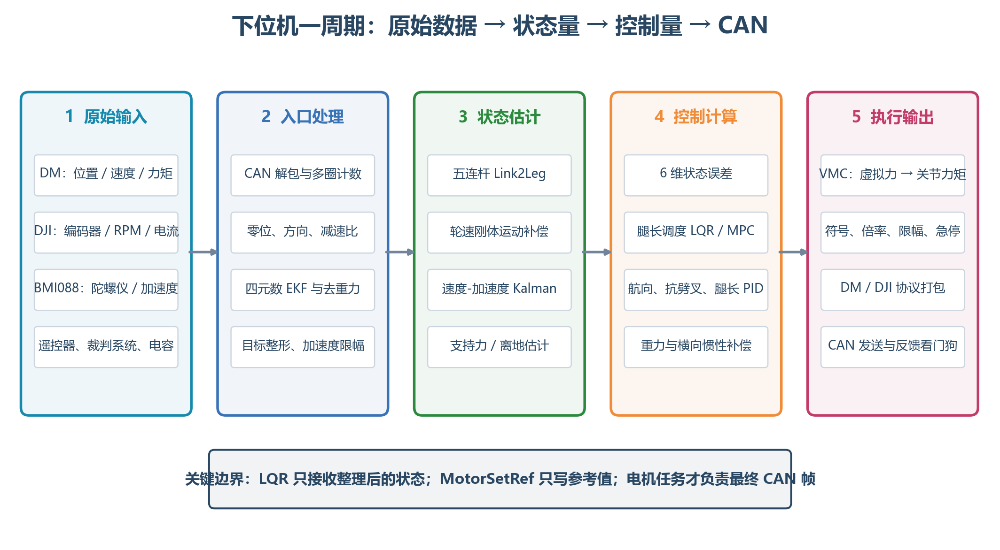

# 下位机原始数据到 LQR 与 CAN 完整链路

> 目标：把 `balance_chassis-main` 中分散在驱动、INS、运动学、估计器、控制器和电机模块里的数据串成一条可以照着实现、调试和移植的链路。本文重点回答三个问题：原始数据经过了什么算法；每一步得到了什么；最终力矩在哪里进入电机模块并通过 CAN 发出。



## 1. 先看结论：一次控制周期做了什么

参考工程的底盘主循环位于：

```text
WheelLeg_LQR/balance_chassis-main/application/chassis/balance.c
└─ BalanceTask()
```

它的真实顺序是：

```text
读取本周期 dt
  ↓
读取上层控制命令 + 电机在线检查 + 功率预算
  ↓
WokingStateSet：把人的命令整理成目标速度、目标航向、目标腿长
  ↓
ParamAssemble：统一 IMU/电机的方向、零位和单位
  ↓
Link2Leg：关节量 → 虚拟腿长、腿角、各自速度、雅可比
  ↓
NormalForceSolve：估计支持力并判断是否离地
  ↓
SpeedCalc：轮速补偿 + 刚体运动学 + Kalman，得到车体速度和加速度
  ↓
CalcLQR_MPC_Fusion：6 维状态误差 → 轮力矩、虚拟髋力矩
  ↓
SynthesizeMotion：叠加航向和抗劈叉控制
  ↓
LegControl：叠加腿长、横滚、重力和侧向惯性补偿
  ↓
VMCProject：虚拟腿力/力矩 → 两个关节电机力矩
  ↓
MotorOutputSet：方向、倍率、模式与急停处理，写入电机参考值
  ↓
电机任务：可选 PID/限幅 → 协议打包 → CANTransmit
```

必须分清两种“CAN”：

- 板间 CAN：上层板把 `Chassis_Ctrl_Cmd_s` 发给底盘板，底盘板回传状态。
- 电机 CAN：底盘板把最终执行命令发给 DM 关节电机和 DJI 轮电机。

## 2. 时间基准：所有微分、积分、滤波都依赖它

### 2.1 底盘控制周期

`StartROBOTTASK()` 每次执行 `RobotTask()` 后 `osDelay(1)`；底盘算法用：

```c
del_t = DWT_GetDeltaT(&balance_dwt_cnt);
```

得到本周期真实间隔 `del_t`，单位为 s。注释期望 200 Hz～1 kHz，当前任务延时是 1 ms，但实际周期还包含任务执行和 RTOS 调度时间，所以微分和积分必须使用测得的 `del_t`，不能在算法里到处写死 `0.001f`。

### 2.2 并行运行的任务

| 任务 | 参考频率 | 产生/消费的数据 |
|---|---:|---|
| `INS_Task()` | 约 1 kHz | BMI088 原始数据 → 姿态、角速度、去重力加速度 |
| `BalanceTask()` | 约 1 kHz | 状态估计、LQR、PID、VMC，写电机参考值 |
| `MotorControlTask()` | 代码实际约 250 Hz 的 DJI 调用节奏¹ | 读取参考值、执行电机环、发 DJI CAN |
| `DMMotorTask()` | 约 500 Hz | 读取关节参考力矩、打包 DM CAN |
| `DaemonTask()` | 100 Hz | 电机与通信离线监测 |

¹ `StartMOTORTASK()` 本身 `osDelay(2)`，而 `MotorControlTask()` 又每两次才调用一次 `DJIMotorControl()`。注释写 500 Hz，但按延时关系推算更接近 250 Hz；应以示波器/CAN 时间戳实测为准。这是移植前应修正或确认的时间问题。

## 3. 原始数据进入下位机后分别经历了什么

### 3.1 DM 关节电机反馈

原始 CAN 帧包含电机状态、位置、速度、力矩和温度。`dmmotor.c` 的接收回调执行：

1. 按位拼接 16 位位置、12 位速度和 12 位力矩。
2. 用 `uint_to_float()` 把协议整数映射回物理范围。
3. 比较本次位置与上次位置跨越 `±π` 的情况，更新圈数。
4. 刷新离线看门狗。

处理后得到：

| 字段 | 含义 | 单位 | 后续用途 |
|---|---|---:|---|
| `measure.position` | 单圈关节角 | rad | 五连杆几何 |
| `measure.velocity` | 关节角速度 | rad/s | 腿长/腿角速度 |
| `measure.torque` | 电机反馈力矩 | N·m | 支持力估计 |
| `measure.total_position` 一类累计量 | 多圈位置 | rad | 需要多圈位置控制时使用 |

这些还是“电机坐标系”数据，不能直接送入运动学。

### 3.2 DJI M3508 轮电机反馈

`DecodeDJIMotor()` 将 CAN 帧转换为：

- `ecd`：0～8191 编码器值；
- `speed`：电机轴转速，rpm；
- `real_current`：带一阶平滑的反馈电流；
- `temperature`：温度；
- `total_round`、`total_angle`：通过编码器跨零判断得到的累计角度。

轮腿平衡使用的是 `measure.speed`。在 `ParamAssemble()` 中转换为轮轴角速度：

```c
left.w_ecd  = -left_motor.speed * RPM_2_RAD_PER_SEC / WHEEL_REDUCTION_RATIO;
right.w_ecd =  right_motor.speed * RPM_2_RAD_PER_SEC / WHEEL_REDUCTION_RATIO;
```

算法依次做了三件事：rpm → rad/s；电机轴 → 轮轴；左右方向统一。输出 `w_ecd` 的单位是 rad/s。

### 3.3 BMI088 陀螺仪与加速度计

`INS_Task()` 中的数据路径是：

```text
BMI088_Read
  ├─ Gyro[3]：角速度，rad/s
  └─ Accel[3]：含重力的比力，m/s²
        ↓
安装误差修正 IMU_Param_Correction
        ↓
Quaternion EKF：陀螺仪预测 + 归一化重力方向校正
        ↓
四元数 q、Yaw/Pitch/Roll、YawTotalAngle、陀螺零偏
        ↓
重力从导航系变换到机体系并从 Accel 中扣除
        ↓
一阶低通滤波
        ↓
MotionAccel_b，再变换为导航系 MotionAccel_n
```

一阶低通在源码中的离散形式为：

$$
a_f[k]=\frac{\Delta t}{T_f+\Delta t}a[k]
+\frac{T_f}{T_f+\Delta t}a_f[k-1]
$$

`ParamAssemble()` 再把姿态方向统一为底盘控制坐标：

```c
yaw     =  YawTotalAngle * DEGREE_2_RAD;
yaw_rate=  Gyro[Z];
pitch   = -Pitch * DEGREE_2_RAD;
pitch_rate = -Gyro[Y];
roll    =  Roll * DEGREE_2_RAD;
roll_rate  = Gyro[X];
```

注意：姿态角输出是 degree，角速度已经是 rad/s。若把 `Gyro[]` 再乘 `DEGREE_2_RAD`，会让反馈缩小约 57.3 倍。

### 3.4 遥控器/键鼠与板间命令

上层命令板先把摇杆、按键整理为 `Chassis_Ctrl_Cmd_s`：

- 摇杆乘比例系数形成 `vx`、`vy`；
- 开关/按键形成运行、旋转、跳跃、腿长和速度模式；
- 云台相对底盘角形成 `offset_angle`；
- 结构体经板间 CAN 发送到底盘板。

底盘的 `CANCommGet()` 返回最近一次完整解包的数据。`WokingStateSet()` 再做目标整形：

- 腿长目标限制在 `[0.14, 0.30] m`；
- 普通模式将 `vx` 按云台偏角修正方向和衰减；
- `target_v` 按 `MAX_ACC_REF * dt` 逐步逼近，形成斜坡限加速度；
- `target_v` 还受功率预算和运动模式限幅；
- `target_yaw = 当前 yaw + offset_angle`；
- 急停/复位时清零速度和距离目标，并把航向目标锁在当前角度。

因此 LQR 使用的 `target_v` 不是遥控器原始值，而是经过坐标解释、斜坡和功率限制后的目标。

### 3.5 裁判系统和超级电容

裁判系统提供底盘功率上限和缓冲能量，超级电容提供电压。参考代码用 PID 对缓冲能量做修正，再根据电容电压决定 `final_power_limit`。它主要影响目标速度上限和发送给超级电容的充电功率，不直接进入 6 维 LQR 状态。

## 4. 入口统一：零位、符号和单位只在这里处理

`ParamAssemble()` 是传感器世界与算法世界的边界。左、右关节的实际安装镜像，因此原工程采用不同公式：

```c
// 左腿
phi1 = PI + lb.position - LIMIT_LINK_RAD;
phi4 =      lf.position + LIMIT_LINK_RAD;
phi1_w =  lb.velocity;
phi4_w =  lf.velocity;
T_back_measure  =  lb.torque;
T_front_measure =  lf.torque;

// 右腿
phi1 = PI - rb.position - LIMIT_LINK_RAD;
phi4 =     -rf.position + LIMIT_LINK_RAD;
phi1_w = -rb.velocity;
phi4_w = -rf.velocity;
T_back_measure  = -rb.torque;
T_front_measure = -rf.torque;
```

移植时不要把这些负号散落到 LQR、VMC 和 CAN 层。推荐每个执行器只保存一组标定参数：

```c
typedef struct {
    float zero_rad;
    float direction;      // 只能取 +1 或 -1
    float reduction;
    float torque_scale;
} MotorCalibration;

q = direction * raw_position / reduction + zero_rad;
qd = direction * raw_velocity / reduction;
tau_measured = direction * raw_torque * torque_scale;
```

入口完成后，算法层应满足同一个物理定义：车前进、机体前倾、腿伸长、虚拟髋正力矩分别有唯一正方向。

## 5. 关节数据如何变成 LQR 能使用的腿状态

### 5.1 `Link2Leg()`：闭链正运动学

五连杆由主动角 `phi1`、`phi4` 先计算 B、D 两点，再求两个圆的交点 C。选定装配分支后得到：

$$
x_{rel}=x_C-\frac{d}{2},\qquad y_{rel}=y_C
$$

$$
L=\sqrt{x_{rel}^2+y_{rel}^2},\qquad
\phi_0=\operatorname{atan2}(y_{rel},x_{rel})
$$

再结合机体俯仰角：

$$
\theta=\phi_0-\frac{\pi}{2}-\mathrm{pitch}
$$

其中 `L` 是虚拟腿长，`phi0` 是腿相对机体的角，`theta` 是腿相对世界竖直方向的倾角。三者不能互换。

### 5.2 速度雅可比

`Link2Leg()` 同时建立：

$$
\begin{bmatrix}\dot L\\\dot\phi_0\end{bmatrix}
=
\begin{bmatrix}j_{11}&j_{12}\\j_{21}&j_{22}\end{bmatrix}
\begin{bmatrix}\dot\phi_1\\\dot\phi_4\end{bmatrix}
$$

所以：

```c
legd  = j11 * phi1_w + j12 * phi4_w;
phi0_w = j21 * phi1_w + j22 * phi4_w;
theta_w = phi0_w - pitch_w;
```

源码还用差分和固定权重低通估计 `legd_dot`、`theta_w_dot`。这种写法默认控制周期变化不大；更稳妥的移植版本应根据 `dt` 和截止频率计算滤波系数。

`Link2Leg()` 最终输出：`leg_len`、`legd`、`theta`、`theta_w`、`phi0`、`phi0_w`、雅可比和闭链从动杆速度 `phi2_w`。

## 6. 轮编码器速度为什么还不能直接当车速

轮电机测速包含机体俯仰和五连杆内部运动造成的轮轴相对转动。参考代码先补偿：

$$
\omega_{wheel}=\omega_{ecd}-\dot\phi_2-\dot{pitch}
$$

再用刚体速度关系计算每侧车体速度：

$$
v_{body}=r_w\omega_{wheel}
+L\dot\theta\cos\theta
+\dot L\sin\theta
$$

左右平均形成轮系速度观测：

$$
v_m=\frac{v_{body,L}+v_{body,R}}{2}
$$

这里的第二、三项就是腿摆动和伸缩对轮轴速度的补偿。只写 `v = rpm × 轮半径`，站立轻晃时会把腿部运动误判成整车平移，LQR 会主动驱轮放大晃动。

## 7. 速度—加速度 Kalman 滤波

参考工程用二状态模型：

$$
\mathbf{x}=\begin{bmatrix}v\\a\end{bmatrix},\qquad
\mathbf{x}_{k+1}=
\begin{bmatrix}1&\Delta t\\0&1\end{bmatrix}\mathbf{x}_k+\mathbf{w}_k
$$

量测为：

$$
\mathbf{z}_k=
\begin{bmatrix}v_m\\a_{imu,x}\end{bmatrix}+\mathbf{n}_k
$$

其中 `v_m` 来自轮与腿的运动学，`a_imu,x` 来自四元数姿态解算、重力扣除、低通和坐标变换后的 `MotionAccel_n[X]`。Kalman 更新后输出：

```c
chassis.vel   = xhat[0];  // m/s
chassis.acc_m = xhat[1];  // m/s²
```

距离状态由速度积分。原工程只在 `fabs(target_v) < 0.1` 时积分距离，否则把 `dist` 与 `target_dist` 同时清零。这是一种“停车位置保持、行驶时只控速度”的工程策略，并非 Kalman 滤波的数学要求，移植时应把它做成明确的模式配置。

## 8. 支持力与离地判断

关节反馈力矩通过逆 VMC 关系估计虚拟腿轴向力 `F_leg_measure` 和髋力矩 `T_hip_measure`。再根据轮轴竖直加速度与牛顿第二定律估计地面支持力：

$$
\ddot z_w=a_{body,z}-\ddot L\cos\theta
+2\dot L\dot\theta\sin\theta
+L\ddot\theta\sin\theta
+L\dot\theta^2\cos\theta
$$

$$
P=F_{leg}\cos\theta+\frac{T_{hip}}{L}\sin\theta
$$

$$
N=P+m_wg+m_w\ddot z_w
$$

当 `N < 20 N` 时置 `fly_flag`。这不是力传感器直接测得的支持力，而是由电机力矩、几何、差分加速度和 IMU 共同得到的估计量，因此需要滤波、滞回和持续时间判断来避免抖动。参考工程当前是单阈值判断，实物上建议改为“离地阈值、落地阈值、连续若干周期”三项配置。

## 9. 进入 LQR 前，所有数据已经变成了什么

### 9.1 单腿/整车状态快照

| 控制量 | 来源链路 | 送入控制器前的单位 |
|---|---|---:|
| `theta` | 关节角 → 闭链几何 → `phi0` → 减机体 `pitch` | rad |
| `theta_w` | 关节速度 → 雅可比 → `phi0_w` → 减 `pitch_w` | rad/s |
| `dist` | Kalman 速度按模式积分 | m |
| `vel` | 轮速补偿 + 腿运动学 + IMU 加速度 Kalman | m/s |
| `pitch` | BMI088 → 四元数 EKF → 方向/单位统一 | rad |
| `pitch_w` | BMI088 Gyro[Y] → 方向统一 | rad/s |
| `leg_len` | 关节角 → 五连杆闭链几何 | m |
| `fly_flag` | 反馈力矩 + 几何 + IMU/差分加速度 | bool |

### 9.2 六维误差向量

参考代码构造：

$$
\mathbf{e}=
\begin{bmatrix}
-\theta\\
-\dot\theta\\
x_{ref}-x\\
v_{ref}-v\\
-pitch\\
-\dot{pitch}
\end{bmatrix}
$$

这说明平衡点约定为 `theta = 0`、`pitch = 0`，而位置和速度使用“目标减测量”。符号已经包含在误差定义里，不能在输出端凭感觉再整体取反。

### 9.3 腿长增益调度

每个 LQR 增益不是常数，而是腿长 `L` 的三次多项式：

$$
k_{ij}(L)=a_{ij}L^3+b_{ij}L^2+c_{ij}L+d_{ij}
$$

计算 12 个增益后，两路输出为：

$$
\begin{bmatrix}T_{wheel}\\T_{hip}\end{bmatrix}=K(L)\mathbf{e}
$$

参考代码还计算 MPC 输出并融合：轮输出当前 `ALPHA_WHEEL = 0`，等于纯 LQR；髋输出 `ALPHA_HIP = 0.3`，即 `70% LQR + 30% MPC`。离地时轮力矩清零，髋通道只保留腿角和腿角速度有关的反馈，避免空中车轮积分加速。

## 10. LQR 后面还做了哪些控制

LQR 输出还不是最终电机命令。

### 10.1 航向串级 PID

```text
target_yaw - yaw
  → 航向角 PID
  → 目标 yaw_rate
  → yaw_rate PID
  → 左右轮差动力矩
```

非离地时把转向输出左减右加；源码另有 `3 × steer_v_pid.Output` 前馈项。

### 10.2 抗劈叉 PID

左右虚拟腿角差：

$$
e_{split}=\phi_{0,L}-\phi_{0,R}
$$

经 PID 后以相反符号叠加到左右 `T_hip`，抑制两条腿前后张开。

### 10.3 腿长串级 PID

```text
target_len - leg_len
  → 腿长位置 PID
  → target_leg_speed
  → 腿长速度 PID
  → F_leg
```

随后加入：

- 车体重力前馈 `BODY_MASS × g`；
- 横滚 PID，左右腿一加一减；
- 转弯时的横向惯性补偿，近似与 `wz × vel × leg_len` 成正比；
- 跳跃状态机对 `F_leg` 和轮力矩的覆盖。

所以 `F_leg` 的单位是 N，`T_hip` 的单位是 N·m，二者属于虚拟腿空间。

## 11. VMC：把虚拟腿控制量变成关节力矩

`VMCProject()` 使用与速度运动学相同的雅可比，依据虚功/瞬时功率守恒：

$$
\boldsymbol\tau=J^T
\begin{bmatrix}F_{leg}\\T_{hip}\end{bmatrix}
$$

在参考代码的系数命名下：

```c
T_back  = j11 * F_leg + j21 * T_hip;
T_front = j12 * F_leg + j22 * T_hip;
```

到这里才得到两只关节电机各自要执行的力矩。LQR 自己只产生轮力矩和虚拟髋力矩；支撑力来自腿长控制；关节力矩由 VMC 合成。

## 12. 力矩到底在哪里填入

### 12.1 应用层写入参考值

`MotorOutputSet()` 是控制算法与电机驱动的交界面：

```c
DMMotorSetRef(lf,  l_side.T_front);
DMMotorSetRef(lb,  l_side.T_back);
DMMotorSetRef(rf, -r_side.T_front);
DMMotorSetRef(rb, -r_side.T_back);

DJIMotorSetRef(l_driven, -l_side.T_wheel * 2598.15f);
DJIMotorSetRef(r_driven,  r_side.T_wheel * 2598.15f);
```

如果你后面“直接把力矩参数发送给控制器”，你的接口应放在这里：上游仍输出 SI 单位的 `N·m`，适配层负责方向、力矩常数/协议倍率和限幅。

推荐抽成：

```c
typedef struct {
    float wheel_left_nm;
    float wheel_right_nm;
    float joint_lf_nm;
    float joint_lb_nm;
    float joint_rf_nm;
    float joint_rb_nm;
} ActuatorTorqueNm;

void MotorAdapter_WriteTorque(const ActuatorTorqueNm *u);
```

这样更换 DM、DJI、MIT、CANopen 或自研驱动器时，LQR/PID/VMC 都不用改。

### 12.2 `SetRef()` 不等于“此刻已经发 CAN”

`DMMotorSetRef()` 与 `DJIMotorSetRef()` 只是把参考值写入电机实例的 `pid_ref`。真正发 CAN 的是独立电机任务：

```text
BalanceTask                    Motor task
算法得到 N·m                  读取 pid_ref 快照
    ↓                              ↓
MotorSetRef 写邮箱  ─────────→ 方向/可选 PID/限幅
                                   ↓
                              协议字节打包
                                   ↓
                              CANTransmit
```

这会产生最多一个电机任务周期的命令延迟。调试波形时，应同时记录“算法输出时间”和“CAN 实际发送时间”。

## 13. 两类电机怎样形成 CAN 帧

### 13.1 DM 关节电机

关节配置为 `TORQUE_LOOP`。`DMMotorTask()`：

1. 读取 `pid_ref`；
2. 根据反转配置处理方向；
3. 若启用角度/速度/力矩 PID，则调用对应环；当前应用层的目标是力矩；
4. 加前馈并把输出限制在 DM 协议的力矩范围；
5. MIT 风格帧中位置目标、速度目标、`Kp`、`Kd` 置零，只编码力矩目标；
6. 停止标志有效时把力矩置零；
7. `CANTransmit()` 发送 8 字节。

因此应用层给 DM 的量是 N·m，协议量化应只出现在 DM 适配器内部。

### 13.2 DJI 轮电机

轮电机配置为 `CURRENT_LOOP`。应用层先用 `2598.15` 把轮力矩换成 DJI 命令刻度。`DJIMotorControl()` 再：

1. 读取 `pid_ref` 快照；
2. 根据配置顺次执行角度环、速度环、电流环；
3. 处理前馈和正反向；
4. 转为 `int16_t`；
5. 最多四台电机合并到同一 8 字节 CAN 帧，每台占两个字节；
6. 停止电机对应的两个字节清零；
7. 按电机组调用 `CANTransmit()`。

当前电流 PID 配置 `Kp=1`，测量输入在模块里写为 0，因此它更接近带输出低通和限幅的命令透传，并不等同于使用 M3508 反馈电流闭环。若你要严格的轮力矩控制，应基于电机力矩常数、减速比、效率和真实电流反馈重新定义适配器。

## 14. 板间 CAN 的封包与回传

`CANCommSend()` 用于长结构体通信：

1. 在载荷前放协议头；
2. 复制结构体字节；
3. 计算 CRC8；
4. 超过 8 字节时分包；
5. 每包调整 DLC 并发送。

`CommNPower()` 每隔一次底盘周期回传位置、速度、姿态、腿状态、热量等数据。它是遥测链路，不是电机力矩链路。

## 15. 建议在移植工程中固定的五层边界

为了以后把同一套算法搬到别的 MCU、RTOS 和电机协议，按以下边界保存代码：

```text
platform/       CAN、SPI、DWT、RTOS，仅与芯片有关
drivers/        BMI088、DM、DJI，仅负责协议收发和原始物理量
estimation/     INS、运动学、速度 Kalman、支持力判断
control/        目标整形、LQR、自己的 PID、VMC、状态机
adapter/        SI 单位力矩 ↔ 电机命令，符号/倍率/限幅
```

控制层只接受结构体，不读取 HAL 句柄：

```c
typedef struct {
    float dt_s;
    float joint_pos_rad[4];
    float joint_vel_rad_s[4];
    float joint_torque_nm[4];
    float wheel_speed_rad_s[2];
    float gyro_rad_s[3];
    float accel_m_s2[3];
    float q[4];
    bool motor_online[6];
} RobotSensorFrame;

typedef struct {
    float target_v_m_s;
    float target_yaw_rad;
    float target_leg_m[2];
    uint32_t mode;
} RobotCommand;

void RobotControl_Step(const RobotSensorFrame *sensor,
                       const RobotCommand *command,
                       ActuatorTorqueNm *torque_out);
```

这样自己的 PID 只需实现统一接口，例如：

```c
typedef float (*PidStepFn)(void *pid,
                           float reference,
                           float measurement,
                           float dt_s);
```

控制器持有 `void *pid` 和函数指针，不需要引用某个 PID 库的头文件。你的 PID 结构体可以包含抗积分饱和、变速积分、微分先行、输出滤波等功能，算法层只负责调用。

## 16. 建议记录的中间量

不要只看最终 CAN 值。按以下断点记录，通常能快速找到翻车原因：

| 断点 | 至少记录 | 能发现的问题 |
|---|---|---|
| 原始驱动层 | 原始字节、时间戳、在线状态 | 丢帧、解包、ID、大小端 |
| 入口统一后 | 关节 rad、rad/s、N·m，轮 rad/s | 零位、方向、减速比 |
| INS 后 | `pitch/pitch_w`、导航系运动加速度 | 轴向、角度单位、重力未扣净 |
| 运动学后 | `L/theta/theta_w/J` | 装配分支、奇异、关节定义错误 |
| Kalman 后 | 原始轮速、补偿速度、`vel/acc` | 速度漂移、滤波参数不合适 |
| LQR 前 | 完整 6 维误差、腿长和增益 | 状态顺序、符号、增益调度错误 |
| LQR 后 | `T_wheel/T_hip` 各分量 | 某个状态反馈过强 |
| VMC 后 | `F_leg`、四个关节力矩 | 雅可比转置或力矩方向错误 |
| 适配器后 | 限幅前后命令、CAN 字节 | 倍率、饱和、协议错误 |

## 17. 上电调试顺序

1. 断开动力，只验证所有传感器单位、方向和时间戳。
2. 架空车体，手动转动每个关节和轮子，核对入口统一后的正方向。
3. 只运行运动学，不发力矩，检查左右腿长与角度是否连续。
4. 只打开腿长控制，小限流验证 `F_leg → VMC → 关节力矩`。
5. 轮子架空，给极小正负轮力矩，验证左右轮物理方向。
6. 启用 LQR，但把轮、髋力矩限制在额定值的 5%～10%。
7. 分别开启航向、抗劈叉、横滚和功率控制，每次只增加一条支路。
8. 最后验证离地、落地、通信丢失、IMU 异常和急停。

任何阶段若方向不对，应回到入口标定或适配器修正，不要通过修改 LQR 增益的正负号掩盖问题。

## 18. 本文对应源码

| 数据阶段 | 参考文件/函数 |
|---|---|
| 周期总调度 | `application/chassis/balance.c`：`BalanceTask()` |
| 命令整形 | `application/chassis/balance.c`：`WokingStateSet()` |
| 单位与方向统一 | `application/chassis/balance.c`：`ParamAssemble()` |
| 五连杆与 VMC | `application/chassis/linkNleg.h`：`Link2Leg()`、`VMCProject()` |
| 速度 Kalman | `application/chassis/speed_estimation.h`：`SpeedEstimationInit()`、`SpeedCalc()` |
| 支持力/离地 | `application/chassis/fly_detection.h`：`NormalForceSolve()` |
| LQR/MPC | `application/chassis/lqr_calc.h`：`CalcLQR_MPC_Fusion()` |
| IMU 姿态 | `modules/imu/ins_task.c`、`modules/algorithm/QuaternionEKF.c` |
| DM 驱动 | `modules/motor/DMmotor/dmmotor.c` |
| DJI 驱动 | `modules/motor/DJImotor/dji_motor.c` |
| 电机任务 | `modules/motor/motor_task.c`、`application/robot_task.h` |
| 板间 CAN | `modules/can_comm/can_comm.c` |

这条链路的核心不是某个单独公式，而是每层只做一种转换：驱动层把字节变成物理量，入口把物理量变成统一坐标，估计层把测量变成状态，控制层把状态变成理想力/力矩，VMC 把虚拟量变成关节力矩，适配层再把 SI 力矩变成具体电机协议。只要这六个边界保持清晰，换腿型、换自己的 PID、换 MCU 或换电机都不需要重写整条控制链。
