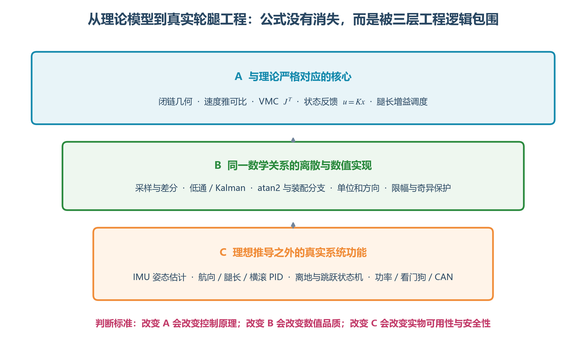

# 轮腿理论推导与工程实际逐项对照

> 本文把“纸面上的轮腿”和 `balance_chassis-main` 的真实代码放在同一张图里。目的不是判断哪一个更正确，而是区分三类内容：哪些代码就是数学公式；哪些只是公式的离散、滤波和数值实现；哪些是理论模型没有写、但实物必须增加的控制和安全功能。



## 1. 最重要的判断方法

工程代码比推导长很多，不代表主要算法变了。可以把它分成三层：

| 层次 | 典型内容 | 改动后的影响 |
|---|---|---|
| A：理论核心 | 闭链几何、雅可比、VMC、状态反馈 | 改错会改变机构和控制原理 |
| B：公式的计算实现 | 采样、差分、滤波、单位、分支、限幅 | 不改变原理，但影响精度、稳定性和实时性 |
| C：实物附加系统 | 状态估计、辅助 PID、离地状态机、功率、CAN、急停 | 通常不属于 LQR 推导，却决定实物能否工作 |

阅读代码时先判断它属于哪一层。这样不会把 CAN 打包当成控制算法，也不会误以为滤波器是 LQR 的一部分。

## 2. 一张表看完：哪里相同，哪里增加了内容

| 阶段 | 理论推导 | 参考工程 | 关系 |
|---|---|---|---|
| 关节输入 | 已知 `phi1`、`phi4` | CAN 解包后做零位、方向、单位转换 | 同一变量，工程增加传感器适配 |
| 闭链位置 | 两圆约束或半角法求 C | `Link2Leg()` 使用半角公式和固定装配分支 | 数学相同 |
| 虚拟腿 | `L=sqrt(x²+y²)`、`phi0=atan2(y,x)` | 同样计算 `leg_len`、`phi0` | 数学相同 |
| 世界腿角 | `theta=phi0-pi/2-pitch` | 同样计算 | 数学相同 |
| 腿速度 | `[Ldot,phi0dot]^T=J[qdot]^T` | `j11...j22` 后做矩阵乘法 | 数学相同 |
| 腿加速度 | 连续二阶导数 | 数值差分后固定权重低通 | 同一物理量，工程近似计算 |
| 轮系速度 | 理想模型中使用车体速度 `v` | 编码器速度减腿转动和俯仰，再加腿摆/伸缩补偿 | 工程为模型状态构造观测值 |
| 速度状态 | 假定可测或模型状态 | 轮系速度与 IMU 加速度做二状态 Kalman | 工程增加状态估计 |
| LQR 状态 | `x=[theta,thetadot,x,v,pitch,pitchdot]` | 构造完全相同的六维误差 | 状态定义相同 |
| LQR 增益 | 固定工作点 `u=-Kx` | `K` 随腿长做三次多项式调度 | 多工作点 LQR 的工程扩展 |
| 虚拟输入 | 轮力矩与髋力矩 | LQR/MPC 融合得到 `T_wheel/T_hip` | LQR 核心相同，增加 MPC 融合 |
| 支撑力 | 由静力或腿长控制给定 | 腿长位置—速度串级 PID + 重力/横滚补偿 | 工程增加高度与姿态控制 |
| VMC | `tau=J^T F` | `VMCProject()` 同式展开 | 数学相同 |
| 航向 | 二维推导通常不含 yaw | 航向角—角速度串级 PID | 工程增加三维运动功能 |
| 左右腿同步 | 单腿模型不描述 | 抗劈叉 PID | 工程增加双腿协调 |
| 接触变化 | LQR 常假定轮始终着地 | 支持力估计、离地标志、空中输出切换 | 工程增加混杂状态机 |
| 执行器 | 理想力矩源 | 倍率、反向、饱和、协议量化、任务延迟 | 工程增加执行器模型 |
| 安全 | 推导一般不展开 | 掉线急停、零力模式、功率限制、看门狗 | 工程增加安全系统 |

## 3. 五连杆位置解：理论和代码基本一一对应

### 3.1 理论中的闭链约束

由两根主动杆先得到 B、D：

$$
\mathbf p_B=
\begin{bmatrix}l_1\cos\phi_1\\l_1\sin\phi_1\end{bmatrix},
\qquad
\mathbf p_D=
\begin{bmatrix}d+l_4\cos\phi_4\\l_4\sin\phi_4\end{bmatrix}
$$

轮轴点 C 同时满足：

$$
\|\mathbf p_C-\mathbf p_B\|=l_2,
\qquad
\|\mathbf p_C-\mathbf p_D\|=l_3
$$

理论文档通过半角代换求出从动杆角 `phi2`，再计算 C 和 `phi3`。

### 3.2 工程代码做的事情

`Link2Leg()` 中：

```c
xB = THIGH_LEN * cos(phi1);
yB = THIGH_LEN * sin(phi1);
xD = THIGH_LEN * cos(phi4) + BODY_WIDTH;
yD = THIGH_LEN * sin(phi4);

phi2 = 2 * atan2(B0 + sqrt(A0*A0 + B0*B0 - BD*BD), A0 + BD);
xC = xB + CALF_LEN * cos(phi2);
yC = yB + CALF_LEN * sin(phi2);
phi3 = atan2(yC-yD, xC-xD);
```

这不是另一套算法，而是推导中的半角闭链解直接翻译成 C。`sqrt` 前面的正号选择了五连杆的一种装配分支。

### 3.3 工程额外承担的责任

理论公式会列出两个装配分支，工程必须长期固定其中一个，不能运行时在两个解之间跳变。参考代码固定了分支，但没有显式完成以下保护：

- 根号内小于零时的浮点容差处理；
- C 点连续性检查；
- 实际关节软限位；
- 分支即将翻转时的故障输出。

所以这里属于“核心公式相同，但参考实现的数值保护还可以加强”。

## 4. 虚拟腿：数学定义完全一致

理论定义髋关节中点 O 到轮轴 C 的向量：

$$
x_{rel}=x_C-\frac d2,qquad y_{rel}=y_C
$$

$$
L=\sqrt{x_{rel}^2+y_{rel}^2}
$$

$$
\phi_0=\operatorname{atan2}(y_{rel},x_{rel})
$$

工程中的 `leg_len`、`phi0` 就是这两个数学量，没有额外近似。

为了得到相对世界竖直方向的腿角，理论和代码都使用：

$$
\theta=\phi_0-\frac\pi2-pitch
$$

这里多出的 `pitch` 不是经验补丁，而是坐标变换：`phi0` 在机体系中，LQR 的 `theta` 要在世界竖直参考下表达。

## 5. 速度雅可比：公式与 `j11...j22` 相同

理论通过对刚性杆约束求时间导数，得到：

$$
\begin{bmatrix}\dot L\\\dot\phi_0\end{bmatrix}
=J
\begin{bmatrix}\dot\phi_1\\\dot\phi_4\end{bmatrix}
$$

工程展开为：

```c
legd   = j11 * phi1_w + j12 * phi4_w;
phi0_w = j21 * phi1_w + j22 * phi4_w;
theta_w = phi0_w - pitch_w;
```

对应关系为：

| 数学量 | 工程变量 |
|---|---|
| `J(1,1)` | `j11` |
| `J(1,2)` | `j12` |
| `J(2,1)` | `j21` |
| `J(2,2)` | `j22` |
| `Ldot` | `legd` |
| `phi0dot` | `phi0_w` |
| `thetadot` | `theta_w` |

### 5.1 理论中的奇异性与工程实际

推导的分母包含：

$$
\sin(\phi_3-\phi_2)
$$

当两根从动杆接近共线时，分母接近零，雅可比会变得很大。参考工程在 `phi2_w` 中直接除以该值，在 `j11...j22` 计算中也依赖对应分母，但没有看到显式的奇异阈值退出。

理论说的是“此处机构失去良好可控性”；工程上必须把它变成：

```c
if (fabsf(sin_32) < singular_eps) {
    output_valid = false;
    torque_out = safe_torque;
}
```

这不是修改数学，而是把理论中的适用条件实现为安全逻辑。

## 6. 加速度：理论连续导数，工程使用差分与滤波

理论中的 `Lddot`、`thetaddot` 是连续函数的二阶导数。编码器只能提供离散样本，因此参考代码用：

$$
\ddot L_{raw}[k]=\frac{\dot L[k]-\dot L[k-1]}{\Delta t}
$$

再使用固定系数低通：

$$
\ddot L_f[k]=0.05\ddot L_{raw}[k]+0.95\ddot L_f[k-1]
$$

`theta_w_dot` 使用另一组 `0.2/0.8` 系数。

相同点：计算目标仍是理论中的二阶导数。

增加项：差分、低通和历史状态是数字控制实现。

工程影响：固定滤波系数与采样周期绑定。若实际周期从 1 ms 改成 2 ms，滤波器的物理截止频率会改变。可移植实现更适合用：

$$
\alpha=\frac{\Delta t}{T_f+\Delta t},\qquad
y[k]=\alpha x[k]+(1-\alpha)y[k-1]
$$

## 7. LQR 中的车速：理论把它当状态，工程必须先估计

### 7.1 理论层

状态空间模型中直接写：

$$
\mathbf x=
\begin{bmatrix}
\theta&\dot\theta&x&\dot x&pitch&\dot{pitch}
\end{bmatrix}^T
$$

模型只规定需要 `xdot`，并没有规定它来自哪个传感器。

### 7.2 工程层新增的轮速补偿

轮编码器不仅包含底盘平移，也包含腿关节和机体俯仰造成的相对转动。工程先计算：

$$
\omega_{wheel}=\omega_{ecd}-\dot\phi_2-\dot{pitch}
$$

再计算：

$$
v_{body}=r_w\omega_{wheel}
+L\dot\theta\cos\theta
+\dot L\sin\theta
$$

这部分不是新的控制器，而是测量方程：把轮编码器和腿状态变成 LQR 所需的车速观测。

### 7.3 工程层新增的 Kalman 滤波

理论假设状态可知，实物的轮速会受打滑、量化和腿运动影响；IMU 加速度又会漂移。因此工程采用：

$$
\begin{bmatrix}v\\a\end{bmatrix}_{k+1}
=
\begin{bmatrix}1&\Delta t\\0&1\end{bmatrix}
\begin{bmatrix}v\\a\end{bmatrix}_k+\mathbf w_k
$$

并同时观测运动学速度和 IMU 加速度。Kalman 只是在估计 LQR 的 `v`，没有改 LQR 的状态含义。

### 7.4 工程采用的停车位置策略

参考代码只在目标速度绝对值较小时积分 `dist`，行驶时将 `dist` 和 `target_dist` 清零。这相当于两种控制模式：

- 行驶：主要控制速度，不积累长距离位置误差；
- 停车：积分距离并提供位置保持。

这不是标准 LQR 推导的必然结果，而是为了避免长距离行驶后位置项过大所加的状态管理策略。

## 8. IMU 姿态：理论中的状态来自额外估计器

理论使用 `pitch` 和 `pitchdot`，通常假定它们已知。实物中：

```text
BMI088 陀螺仪 + 加速度计
  → 安装误差修正
  → 四元数 EKF
  → Pitch / Roll / Yaw
  → 重力扣除
  → 导航系运动加速度
```

四元数 EKF 属于状态测量层，不属于 LQR 本体。它增加了陀螺零偏、过程噪声、量测噪声、加速度可信度和姿态坐标变换等实际问题。

理论和工程之间真正需要一致的是：

- `pitch=0` 时机体处于设计平衡姿态；
- `pitch` 正方向与模型一致；
- `pitchdot` 与 `pitch` 使用同一正方向；
- 单位分别是 rad 和 rad/s。

## 9. LQR：哪里完全一样，哪里做了增益调度

### 9.1 理论 LQR

线性化系统：

$$
\dot{\mathbf x}=A\mathbf x+B\mathbf u
$$

性能指标：

$$
J=\int_0^\infty
(\mathbf x^TQ\mathbf x+\mathbf u^TR\mathbf u)dt
$$

求 Riccati 方程得到反馈增益 `K`，控制律写作：

$$
\mathbf u=-K\mathbf x
$$

### 9.2 工程状态向量

工程构造：

$$
\mathbf e=
\begin{bmatrix}
-\theta\\-\dot\theta\\x_{ref}-x\\v_{ref}-v\\-pitch\\-\dot{pitch}
\end{bmatrix}
$$

然后做矩阵乘法得到 `T_wheel` 和 `T_hip`。负号是状态误差定义的一部分，与把 `-Kx` 写进 `K` 或误差中是等价的，只要生成增益时使用相同约定。

### 9.3 工程增加腿长增益调度

腿长变化后，质心高度、机构等效惯量和输入映射都会变化，单个工作点的 `K` 不再覆盖全部高度。工程离线计算多个腿长的增益，再拟合：

$$
k_{ij}(L)=a_{ij}L^3+b_{ij}L^2+c_{ij}L+d_{ij}
$$

在线只需要若干乘加。这仍属于 LQR，只是从“单工作点定常 LQR”扩展为“随参数变化的增益调度 LQR”。

### 9.4 工程又增加了 MPC 融合

参考代码同时计算 LQR 与 MPC 输出：

$$
u=(1-\alpha)u_{LQR}+\alpha u_{MPC}
$$

当前轮通道 `alpha=0`，实际就是纯 LQR；髋通道 `alpha=0.3`。这部分已超出纯 LQR 理论，属于额外控制策略。判断问题时应分别记录 `u_LQR`、`u_MPC` 和融合后输出，避免把 MPC 的影响误判成 LQR 增益问题。

## 10. VMC：理论与代码保持同一个功率映射

理论利用虚功/瞬时功率：

$$
F_L\dot L+T_0\dot\phi_0
=\tau_1\dot\phi_1+\tau_4\dot\phi_4
$$

结合速度雅可比得到：

$$
\begin{bmatrix}\tau_1\\\tau_4\end{bmatrix}
=J^T
\begin{bmatrix}F_L\\T_0\end{bmatrix}
$$

工程 `VMCProject()` 展开为：

```c
T_back  = j11 * F_leg + j21 * T_hip;
T_front = j12 * F_leg + j22 * T_hip;
```

这部分没有经验系数，也没有另一套“工程 VMC”。只要雅可比、坐标方向和单位一致，代码就是公式。

工程在 VMC 前增加了 `F_leg` 和 `T_hip` 的多个来源，但最后仍通过同一个 `J^T` 映射到电机力矩。

## 11. 支撑力：理论只给物理关系，工程增加闭环和前馈

理论用牛顿第二定律说明静止时需要：

$$
F_{L,left}+F_{L,right}\approx Mg
$$

若左右平均分担：

$$
F_{L,0}\approx\frac{Mg}{2}
$$

工程的 `LegControl()` 增加：

```text
目标腿长 - 当前腿长
  → 腿长位置 PID
  → 目标伸缩速度
  → 腿长速度 PID
  → 动态支撑力
  + 重力前馈
  ± 横滚补偿
  ± 转弯横向惯性补偿
```

这些附加项的角色不同：

| 项目 | 数学含义 | 是否改变 LQR 模型 |
|---|---|---|
| 腿长串级 PID | 独立的高度控制回路 | 不直接改变六维 LQR |
| 重力前馈 | 抵消静态重力 | 不改变反馈结构 |
| 横滚 PID | 分配左右支撑力 | 是三维车体的额外回路 |
| 横向惯性补偿 | 转弯时左右支撑力前馈 | 是二维模型外的扩展 |
| 跳跃覆盖 | 状态机直接指定阶段力 | 暂时绕过普通腿长控制 |

## 12. 航向和抗劈叉：单腿二维模型里没有

### 12.1 航向控制

理论推导通常只研究车体前后平衡平面，不包含 yaw。工程使用：

```text
yaw 角度 PID → yaw 角速度目标
yaw 角速度 PID → 左右轮差动力矩
```

它与 LQR 轮力矩做叠加：LQR 负责左右轮的共同分量，航向 PID 负责差动分量。

### 12.2 抗劈叉控制

单腿模型不会约束左、右虚拟腿角一致。工程根据：

$$
e_{split}=\phi_{0,L}-\phi_{0,R}
$$

通过 PID 在左右 `T_hip` 上施加相反力矩。这是双腿同步约束，不属于单腿 LQR。

二者如果增益过大，会与 LQR 争夺执行器余量，所以最终必须在合成后统一限幅，而不能只分别限制每个控制器。

## 13. 离地检测：从连续模型变成混杂控制系统

标准 LQR 假设模型结构固定，例如轮子持续与地面接触。轮腿机器人离地后，输入矩阵和约束条件都改变，原反馈律不能原样使用。

工程通过关节反馈力矩、VMC 逆映射和轮轴竖直加速度估计支持力 `N`，再用阈值得到 `fly_flag`。进入离地状态后：

- 轮力矩清零；
- 髋力矩只保留腿角和腿角速度相关分量；
- 速度/距离状态按离地情况重置。

因此实际系统不是一套始终不变的线性控制器，而是：

```text
接地模型 + 接地控制律
          ↕ 支持力条件
离地模型 + 空中控制律
```

这类“连续控制器 + 离散模式切换”称为混杂系统。参考代码只用了单阈值，实物建议增加滞回与计时，避免接地点附近每周期切换。

## 14. 目标值也不是直接进入理论公式

理论通常把 `v_ref`、`x_ref` 当作已知目标。工程在 `WokingStateSet()` 中增加：

- 遥控器摇杆比例换算；
- 云台与底盘坐标转换；
- 偏角过大时反向行驶；
- 速度随偏角衰减；
- `MAX_ACC_REF × dt` 的目标斜坡；
- 运动模式、跳跃模式和功率预算限速；
- 急停时清零目标并锁定当前航向。

这些是参考指令整形。它们不会改变 LQR 的 `K`，但会改变 LQR 看到的误差。如果目标速度一步跳变，LQR 会立即请求大力矩；目标斜坡能把这一瞬时冲击限制在执行器可承受范围内。

## 15. 电机不是理想力矩源：理论输出后又增加了一层

理论到 `tau` 为止；实物还要经过：

```text
理论力矩 N·m
  → 左右安装方向
  → 减速比、力矩常数、效率或协议倍率
  → 电机/驱动器允许范围
  → 整数定点量化
  → CAN 帧
  → 驱动器电流环
  → 实际电磁力矩
```

参考工程中：

- DM 关节电机接收 N·m，驱动层将其编码为 MIT 风格力矩字段；
- DJI 轮电机先乘 `2598.15` 变成协议命令，再按电机组写入 8 字节帧；
- 左右电机在 `MotorOutputSet()` 中有不同负号；
- `SetRef()` 只写参考值，独立电机任务才真正发送 CAN。

因此理论计算的力矩与 CAN 数字不是同一个量。若把协议倍率放进 LQR 增益中，换电机时整套控制器都要重做，也无法检查单位。

## 16. 理论通常省略、工程必须存在的安全功能

| 工程功能 | 为什么理论中常省略 | 实物缺少后的结果 |
|---|---|---|
| 电机掉线检测 | 默认传感器和执行器永远在线 | 单边继续出力，快速翻车 |
| 急停/零力模式 | 不属于稳定性推导 | 故障时无法立即解除力矩 |
| 力矩和电流限幅 | 理论常假设输入无限或在线性范围内 | 饱和后模型失配、积分累积 |
| 关节软限位 | 数学模型只规定可达域 | 撞机械限位或进入奇异区 |
| 功率限制 | 模型不描述裁判系统和电源 | 母线掉压、掉电或违规 |
| 数据新鲜度 | 默认每个状态同时采样 | 用新姿态配旧关节数据 |
| NaN/Inf 检查 | 精确数学不会产生浮点异常 | 一次非法根号污染全部输出 |
| 看门狗 | 不属于动力学方程 | 通信中断后保持旧命令 |

这些功能不应写进 `K` 矩阵或运动学公式，而应围绕控制核心形成独立安全层。

## 17. 参考工程与“更稳妥工程实现”的差距

以下不是说参考代码不能工作，而是理论条件在代码中还有可明确化的地方：

| 当前实现 | 隐含风险 | 推荐补充 |
|---|---|---|
| 闭链根号直接计算 | 标定误差可能使根号内出现小负数 | 容差夹紧，大负数报故障 |
| 雅可比分母直接相除 | 接近奇异构型时输出放大 | 奇异阈值、软限位和降额 |
| 差分滤波使用固定权重 | 周期变化会改变截止频率 | 根据真实 `dt` 算系数 |
| 离地使用单阈值 | 接触边缘可能抖动 | 双阈值滞回 + 连续周期确认 |
| 控制与电机任务异步 | 输出存在变化延迟 | 时间戳、双缓冲或固定调度 |
| DJI 任务注释与调用节奏不完全一致 | 实际频率可能低于预期 | CAN 时间戳实测并统一配置 |
| DJI 电流环测量值写 0 | 更接近命令透传而非真实电流闭环 | 明确开环命令或接入真实电流反馈 |
| 行驶时清零距离状态 | 行为隐藏在估计器内部 | 做成明确的位置/速度控制模式 |
| 多个控制器分别输出 | 合成后可能超过总执行器能力 | 最终统一限幅与优先级分配 |

## 18. 哪些参数来自理论，哪些必须实验标定

### 18.1 应由 CAD、称重或辨识得到

- 车体质量、轮质量；
- 轮半径；
- 质心位置与转动惯量；
- 五连杆各杆长和髋关节间距；
- 电机减速比、力矩常数和传动效率；
- 执行器延迟、摩擦和死区。

这些参数进入动力学模型或执行器映射，不能仅靠 PID 调整掩盖误差。

### 18.2 由理论设计后再通过仿真/实物修正

- LQR 的 `Q/R`；
- 不同腿长下的 `K(L)`；
- Kalman 的过程噪声与测量噪声；
- 腿长、航向、横滚、抗劈叉 PID；
- 目标斜坡和最终力矩限幅。

### 18.3 主要由实验确定

- 编码器零位和方向；
- IMU 安装矩阵和静态偏置；
- 离地/落地阈值与确认时间；
- 摩擦、死区、效率补偿；
- 安全姿态范围和关节软限位；
- CAN 超时与急停时间。

## 19. 调试时怎样判断是哪一层错了

### 19.1 静止不出力时数据已经错

优先检查驱动/坐标层：零位、正方向、单位、IMU 安装、减速比。此时不要调 LQR。

### 19.2 手动推动机构，几何量不连续

检查闭链分支、角度跨越、根号域和雅可比奇异性。这属于运动学层。

### 19.3 状态正确，但给定轮力矩方向相反

检查误差定义、`K` 的符号约定和电机适配方向。先用单个小力矩绕过 LQR 验证执行器方向。

### 19.4 能站立但高速抖动

检查采样周期、延迟、差分噪声、滤波器和电机内环带宽。这往往是 B 层问题，而不是公式错误。

### 19.5 平衡正常，转向或伸腿时翻车

检查辅助 PID 与 LQR 的叠加、总力矩饱和、左右腿同步、功率限制和状态机。此时问题多在 C 层耦合。

### 19.6 离地或落地瞬间失控

检查支持力估计、模式切换、积分清零、输出连续性和接地恢复逻辑。这不是单一线性模型能够独立解决的问题。

## 20. 从公式到实物的完整关系

可以把整套系统写成下面的组合：

$$
\text{原始传感器}
\xrightarrow{\text{标定/姿态/滤波}}
\hat{\mathbf x}
\xrightarrow{\text{LQR}}
\begin{bmatrix}T_w\\T_h\end{bmatrix}
$$

$$
F_L=F_{length\ PID}+F_{gravity}+F_{roll}+F_{turn}
$$

$$
\boldsymbol\tau_{joint}
=J^T
\begin{bmatrix}F_L\\T_h+T_{split}\end{bmatrix}
$$

$$
\boldsymbol\tau_{wheel}
=T_w+T_{yaw}
$$

$$
\begin{bmatrix}\boldsymbol\tau_{joint}\\\boldsymbol\tau_{wheel}\end{bmatrix}
\xrightarrow{\text{状态机/限幅/功率/适配}}
\text{CAN 命令}
$$

第一行是状态估计与 LQR；第二、三、四行是腿长、VMC 和辅助自由度控制；最后一行是实物执行层。理论推导提供了中间的核心关系，工程代码围绕核心补齐了“如何测到状态、如何处理模型没包含的自由度、如何安全地让电机执行”。

## 21. 对应阅读位置

| 想核对的内容 | 理论文档 | 工程源码 |
|---|---|---|
| 闭链位置与装配分支 | `01` 第 2～3 节 | `linkNleg.h`：`Link2Leg()` |
| 虚拟腿定义 | `01` 第 4 节 | `linkNleg.h`：`leg_len/phi0/theta` |
| 速度雅可比与奇异性 | `01` 第 5 节 | `linkNleg.h`：`j11...j22` |
| VMC | `01` 第 6 节 | `linkNleg.h`：`VMCProject()` |
| 重力和整车力学 | `01` 第 7～8 节 | `balance.c`：`LegControl()` |
| LQR | `01` 第 9 节 | `lqr_calc.h` |
| 安全 C 实现 | `02` 第 4～18 节 | `portable_control/` |
| 原始数据到 CAN | `05` 全文 | `balance.c`、电机与 INS 模块 |

建议先用本文确定某段代码属于 A、B、C 哪一层，再回到对应理论章节或源码函数细看。这样看到工程中的滤波、PID 和状态机时，不会误以为原来的力学推导失效；看到代码与公式一致的部分时，也不会因为变量名不同而重复推导一遍。
